# SkillYards AI Call Analyzer — OpenAI Integration Plan

This document outlines the design and architectural implementation details for **AI-powered Call Auditing and Sales Analytics** using the **OpenAI API Suite (Whisper & GPT-4o)** on top of the SkillYards CRM database.

---

## 1. System Architecture

To prevent API timeouts during calls and ensure scalability, the architecture uses a decoupled, queue-based background processing system.

```mermaid
sequenceDiagram
    participant App as Android Call Tracker
    participant API as Next.js API Server
    participant R2 as Cloudflare R2
    participant DB as Neon Database
    participant Q as Background Queue (BullMQ)
    participant Whisper as OpenAI Whisper API
    participant GPT as OpenAI GPT-4o API

    App->>API: POST /api/telephony/gsm-callback (base64 audio + metadata)
    API->>R2: Upload audio file (.m4a/.mp3)
    API->>DB: Log call record (status: pending)
    API->>Q: Add audit job to queue
    API-->>App: Return success: true (App deletes local file)

    rect rgb(20, 20, 30)
        Note over Q,GPT: Asynchronous Background Processing
        Q->>R2: Fetch audio file stream
        Q->>Whisper: Send audio for Transcription (whisper-1)
        Whisper-->>Q: Return verbatim Hinglish text transcript
        Q->>GPT: Request structured analysis (gpt-4o)
        GPT-->>Q: Return structured audit JSON
        Q->>DB: Save transcript, audit JSON, and mark status: completed
    end
```



---

## 2. Individual Call Auditing (Micro-level Insights)

Every completed call lasting longer than 15 seconds is queued for auditing. The process combines two state-of-the-art OpenAI models:
1.  **OpenAI Whisper (`whisper-1`)**: Transcribes the audio. Setting the transcription language hint to `"hi"` ensures optimal translation and processing of Hindi, English, and Hinglish accents.
2.  **OpenAI GPT-4o**: Evaluates the transcript against compliance checkmarks, tone, and script guidelines, returning a structured JSON format.

### Key Auditing Metrics Extracted

| Metric | Description | OpenAI Implementation Strategy |
| :--- | :--- | :--- |
| **Verbatim Transcript** | Verbatim transcript in Hinglish/English/Hindi. | `openai.audio.transcriptions.create` using `whisper-1`. |
| **Talk-to-Listen Ratio** | Percentage of time the agent spoke vs. the customer. | GPT-4o estimates block-by-block text ratio. |
| **Sentiment Analysis** | Positive, neutral, or negative customer reaction. | GPT-4o reads conversation tone shifts and final outcome. |
| **Script Adherence** | Checking if the agent hit mandatory pitch points. | GPT-4o semantic matching against configured sales script. |
| **Objection Resolution** | Rating how effectively the agent handled pushbacks. | GPT-4o grades agent responses following customer objections. |

---

## 3. Weekly & Monthly Reports (Macro-level Audits)

Aggregated analytics compiled by automated workers show team-wide performance trends over time.

### A. Weekly Agent Snapshots
A weekly scheduled job collects all audited call records for a given telecaller to generate:
*   **Average Scorecard**: Average talk time, average sentiment score, and average lead interest score.
*   **Objection Log**: A ranked breakdown of the top 3 objections they faced (e.g., price, competitor features, distance).
*   **AI Training Tip**: Focused feedback (e.g., *"Agent handled the 'too expensive' objection well, but did not transition to the discount offer. Suggest practicing trial-closing"*).

### B. Monthly Executive Summaries
Correlates call transcripts with actual sales conversions from the `enquiries` table:
*   **Winning Pitch Extraction**: Compares transcripts of won conversions against lost ones to find successful keywords and phrases.
*   **Churn & Drop-off Analysis**: Flags enquiries that are likely to fail based on hesitation markers or objections in the call logs.

---

## 4. Schema Blueprint Extensions (`packages/db`)

Create these schemas in your database to persist individual call audits and performance snapshots.

### 4.1 Individual Call Audits Table

```javascript
// packages/db/src/schema/followUpAudits.js
import { pgTable, uuid, text, integer, jsonb, timestamp } from "drizzle-orm/pg-core";
import { followUps } from "./followUps";

export const followUpAudits = pgTable("follow_up_audits", {
  id: uuid("id").defaultRandom().primaryKey(),
  followUpId: uuid("follow_up_id")
    .references(() => followUps.id, { onDelete: "cascade" })
    .notNull(),
  
  // Auditing Metrics
  talkRatioAgent: integer("talk_ratio_agent").notNull(), // e.g. 60 for 60%
  talkRatioCustomer: integer("talk_ratio_customer").notNull(), // e.g. 40 for 40%
  
  // Script checklist (e.g., {"intro": true, "pricing_explained": false})
  scriptAdherence: jsonb("script_adherence").notNull(),
  
  // Detailed feedback and coaching points
  objectionHandlingScore: integer("objection_handling_score"), // 1-10
  coachingFeedback: text("coaching_feedback"), 
  
  createdAt: timestamp("created_at").defaultNow().notNull(),
});
```

### 4.2 Weekly & Monthly Snapshot Tables

```javascript
// packages/db/src/schema/performanceSnapshots.js
import { pgTable, uuid, text, integer, jsonb, date, timestamp } from "drizzle-orm/pg-core";
import { employees } from "./employees";

export const performanceSnapshots = pgTable("performance_snapshots", {
  id: uuid("id").defaultRandom().primaryKey(),
  employeeId: uuid("employee_id")
    .references(() => employees.id, { onDelete: "cascade" })
    .notNull(),
  type: text("type").notNull(), // 'weekly' | 'monthly'
  startDate: date("start_date").notNull(),
  endDate: date("end_date").notNull(),
  
  // Aggregated Stats
  totalCalls: integer("total_calls").notNull(),
  reachedCalls: integer("reached_calls").notNull(),
  avgDurationSeconds: integer("avg_duration_seconds").notNull(),
  conversionRate: integer("conversion_rate"), // percentage
  
  // AI Derived Analysis
  strengths: text("strengths").array(),
  weaknesses: text("weaknesses").array(),
  objectionsEncountered: jsonb("objections_encountered"), // e.g. [{"name": "price", "count": 12}]
  overallScore: integer("overall_score"), // 1-100 rating
  
  createdAt: timestamp("created_at").defaultNow().notNull(),
});
```

---

## 5. OpenAI Auditing Pipeline Implementation

Here is the clean Node.js implementation script using the **OpenAI SDK** to transcribe and analyze the call.

```javascript
import { OpenAI } from "openai";
import { s3Client } from "../integrations/r2/r2.client";
import { GetObjectCommand } from "@aws-sdk/client-s3";
import fs from "fs";
import path from "path";

const openai = new OpenAI({ apiKey: process.env.OPENAI_API_KEY });

export async function auditCallWithOpenAI(recordingKey) {
  // 1. Download audio file from Cloudflare R2
  const bucketParams = { Bucket: process.env.R2_BUCKET, Key: recordingKey };
  const s3Response = await s3Client.send(new GetObjectCommand(bucketParams));
  
  // Write to temporary local file for Whisper ingestion
  const tempFilePath = path.join("/tmp", path.basename(recordingKey));
  const writeStream = fs.createWriteStream(tempFilePath);
  
  // Pipe S3 body to file stream
  const responseBuffer = Buffer.from(await s3Response.Body.transformToByteArray());
  fs.writeFileSync(tempFilePath, responseBuffer);

  try {
    // 2. Transcribe using Whisper (Optimized for Hinglish/Hindi speech)
    const transcription = await openai.audio.transcriptions.create({
      file: fs.createReadStream(tempFilePath),
      model: "whisper-1",
      language: "hi", // Forces translation optimizations for Hinglish/Indian accents
    });

    const transcriptText = transcription.text;

    // 3. Analyze using GPT-4o with Structured Outputs
    const analysisResponse = await openai.chat.completions.create({
      model: "gpt-4o",
      response_format: { type: "json_object" },
      messages: [
        {
          role: "system",
          content: `You are a sales auditor. Analyze the provided sales call transcript. 
          Return a JSON object matching this structure:
          {
            "summary": "Short 2 sentence summary of call.",
            "sentiment": "Positive" | "Neutral" | "Negative",
            "leadScore": 85, // Integer 0-100 indicating buyer intent
            "talkRatioAgent": 65, // Percentage of time agent spoke (estimated from transcript)
            "talkRatioCustomer": 35,
            "scriptAdherence": {
              "greeting": true,
              "pricing_explained": false,
              "next_steps_set": true
            },
            "objectionsHandled": ["pricing was high", "location far away"],
            "coachingFeedback": "Agent spoke too fast when price was asked. Recommended to pause and clarify value."
          }`
        },
        {
          role: "user",
          content: `Call Transcript:\n${transcriptText}`
        }
      ]
    });

    const auditData = JSON.parse(analysisResponse.choices[0].message.content);

    // Clean up temporary local file
    fs.unlinkSync(tempFilePath);

    return {
      transcriptText,
      auditData
    };
  } catch (error) {
    if (fs.existsSync(tempFilePath)) fs.unlinkSync(tempFilePath);
    throw error;
  }
}
```

---

## 6. Implementation Stages & Timeline


