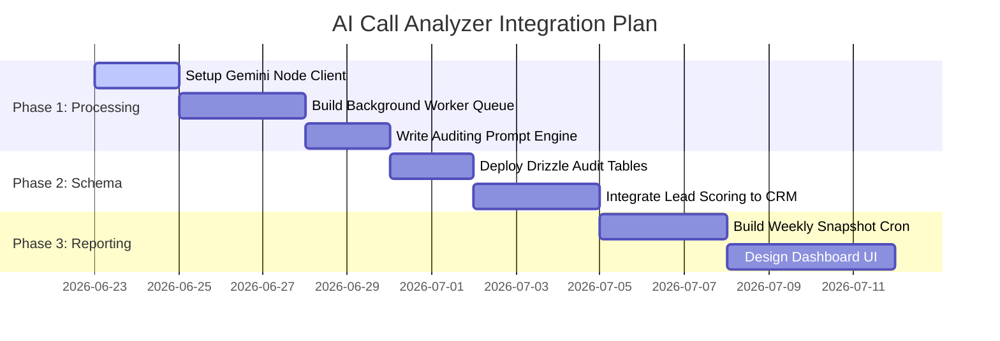

# SkillYards AI Call Analyzer — Gemini 1.5 Flash Integration Plan

This document outlines the design and architectural implementation details for **AI-powered Call Auditing and Sales Analytics** using **Gemini 1.5 Flash** on top of the SkillYards CRM database.

---

## 1. System Architecture

To prevent API timeouts during calls and ensure scalability, the architecture uses a decoupled, queue-based background processing system.

```mermaid
sequenceDiagram
    participant App as Android Call Tracker
    participant API as Next.js API Server
    participant R2 as Cloudflare R2
    participant DB as Neon Database
    participant Q as Background Queue (BullMQ)
    participant Gem as Gemini 1.5 Flash API

    App->>API: POST /api/telephony/gsm-callback (base64 audio + metadata)
    API->>R2: Upload audio file (.m4a/.mp3)
    API->>DB: Log call record (status: pending)
    API->>Q: Add audit job to queue
    API-->>App: Return success: true (App deletes local file)

    rect rgb(20, 20, 30)
        Note over Q,Gem: Asynchronous Background Processing
        Q->>R2: Fetch audio file stream
        Q->>Gem: Send raw audio + Structured Prompt
        Gem-->>Q: Return verbatim transcript & audit JSON
        Q->>DB: Save transcript, audit JSON, and mark status: completed
    end
```



---

## 2. Individual Call Auditing (Micro-level Insights)

Every completed call lasting longer than 15 seconds is queued for auditing. The process feeds the raw audio buffer directly into **Gemini 1.5 Flash** (which natively understands audio waveforms, tone, and pacing without needing a separate transcription model).

### Key Auditing Metrics Extracted

| Metric | Description | Gemini Implementation Strategy |
| :--- | :--- | :--- |
| **Verbatim Transcript** | Verbatim transcript in Hinglish/English/Hindi. | Gemini's native audio-to-text decoding. |
| **Talk-to-Listen Ratio** | Percentage of time the agent spoke vs. the customer. | Gemini estimates block-by-block audio speech ratio. |
| **Sentiment Analysis** | Positive, neutral, or negative customer reaction. | Gemini evaluates voice tone shifts and final interest. |
| **Script Adherence** | Checking if the agent hit mandatory pitch points. | Gemini compares speech against configured sales script. |
| **Objection Resolution** | Rating how effectively the agent handled pushbacks. | Gemini grades agent responses following customer objections. |

---

## 3. Weekly & Monthly Reports (Macro-level Audits)

Aggregated analytics compiled by automated workers show team-wide performance trends over time.

### A. Weekly Agent Snapshots
A weekly scheduled job collects all audited call records for a given telecaller to generate:
*   **Average Scorecard**: Average talk time, average sentiment score, and average lead interest score.
*   **Objection Log**: A ranked breakdown of the top 3 objections they faced (e.g., price, competitor features, distance).
*   **AI Training Tip**: Focused feedback (e.g., *"Agent handled the 'too expensive' objection well, but did not transition to the discount offer. Suggest practicing trial-closing"*).

### B. Monthly Executive Summaries
Correlates call transcripts with actual sales conversions from the `enquiries` table:
*   **Winning Pitch Extraction**: Compares transcripts of won conversions against lost ones to find successful keywords and phrases.
*   **Churn & Drop-off Analysis**: Flags enquiries that are likely to fail based on hesitation markers or objections in the call logs.

---

## 4. Schema Blueprint Extensions (`packages/db`)

Create these schemas in your database to persist individual call audits and performance snapshots.

### 4.1 Individual Call Audits Table

```javascript
// packages/db/src/schema/followUpAudits.js
import { pgTable, uuid, text, integer, jsonb, timestamp } from "drizzle-orm/pg-core";
import { followUps } from "./followUps";

export const followUpAudits = pgTable("follow_up_audits", {
  id: uuid("id").defaultRandom().primaryKey(),
  followUpId: uuid("follow_up_id")
    .references(() => followUps.id, { onDelete: "cascade" })
    .notNull(),
  
  // Auditing Metrics
  talkRatioAgent: integer("talk_ratio_agent").notNull(), // e.g. 60 for 60%
  talkRatioCustomer: integer("talk_ratio_customer").notNull(), // e.g. 40 for 40%
  
  // Script checklist (e.g., {"intro": true, "pricing_explained": false})
  scriptAdherence: jsonb("script_adherence").notNull(),
  
  // Detailed feedback and coaching points
  objectionHandlingScore: integer("objection_handling_score"), // 1-10
  coachingFeedback: text("coaching_feedback"), 
  
  createdAt: timestamp("created_at").defaultNow().notNull(),
});
```

### 4.2 Weekly & Monthly Snapshot Tables

```javascript
// packages/db/src/schema/performanceSnapshots.js
import { pgTable, uuid, text, integer, jsonb, date, timestamp } from "drizzle-orm/pg-core";
import { employees } from "./employees";

export const performanceSnapshots = pgTable("performance_snapshots", {
  id: uuid("id").defaultRandom().primaryKey(),
  employeeId: uuid("employee_id")
    .references(() => employees.id, { onDelete: "cascade" })
    .notNull(),
  type: text("type").notNull(), // 'weekly' | 'monthly'
  startDate: date("start_date").notNull(),
  endDate: date("end_date").notNull(),
  
  // Aggregated Stats
  totalCalls: integer("total_calls").notNull(),
  reachedCalls: integer("reached_calls").notNull(),
  avgDurationSeconds: integer("avg_duration_seconds").notNull(),
  conversionRate: integer("conversion_rate"), // percentage
  
  // AI Derived Analysis
  strengths: text("strengths").array(),
  weaknesses: text("weaknesses").array(),
  objectionsEncountered: jsonb("objections_encountered"), // e.g. [{"name": "price", "count": 12}]
  overallScore: integer("overall_score"), // 1-100 rating
  
  createdAt: timestamp("created_at").defaultNow().notNull(),
});
```

---

## 5. Gemini Auditing Pipeline Implementation

Here is the Node.js implementation script using the **Google Generative AI SDK** to analyze call audio files stored in R2.

```javascript
import { GoogleGenAI } from "@google/genai";
import { s3Client } from "../integrations/r2/r2.client";
import { GetObjectCommand } from "@aws-sdk/client-s3";

// Initialize Gemini client using environment API key
const ai = new GoogleGenAI({ apiKey: process.env.GEMINI_API_KEY });

export async function auditCallWithGemini(recordingKey) {
  // 1. Download audio file buffer from Cloudflare R2
  const bucketParams = { Bucket: process.env.R2_BUCKET, Key: recordingKey };
  const s3Response = await s3Client.send(new GetObjectCommand(bucketParams));
  const audioBuffer = Buffer.from(await s3Response.Body.transformToByteArray());

  // 2. Format the audio file as a Gemini inline part (base64)
  const audioPart = {
    inlineData: {
      data: audioBuffer.toString("base64"),
      mimeType: "audio/mp3", // supports audio/mp3, audio/m4a, audio/wav, etc.
    },
  };

  // 3. Define the structured response schema
  const responseSchema = {
    type: "OBJECT",
    properties: {
      transcription: { type: "STRING" },
      summary: { type: "STRING" },
      sentiment: { type: "STRING", enum: ["Positive", "Neutral", "Negative"] },
      leadScore: { type: "INTEGER" },
      talkRatioAgent: { type: "INTEGER" },
      talkRatioCustomer: { type: "INTEGER" },
      scriptAdherence: {
        type: "OBJECT",
        properties: {
          greeting: { type: "BOOLEAN" },
          pricing_explained: { type: "BOOLEAN" },
          next_steps_set: { type: "BOOLEAN" },
        },
        required: ["greeting", "pricing_explained", "next_steps_set"],
      },
      objectionsHandled: {
        type: "ARRAY",
        items: { type: "STRING" },
      },
      coachingFeedback: { type: "STRING" },
    },
    required: [
      "transcription",
      "summary",
      "sentiment",
      "leadScore",
      "talkRatioAgent",
      "talkRatioCustomer",
      "scriptAdherence",
      "objectionsHandled",
      "coachingFeedback",
    ],
  };

  // 4. Request structured audit output from Gemini 1.5 Flash
  const response = await ai.models.generateContent({
    model: "gemini-1.5-flash",
    contents: [
      audioPart,
      {
        role: "user",
        text: `You are a sales auditor. Analyze the provided audio recording of a sales call.
        Provide a complete verbatim transcription, and analyze compliance and performance.
        Return the final audit strictly formatted matching the requested JSON schema.`
      }
    ],
    config: {
      responseMimeType: "application/json",
      responseSchema: responseSchema,
    }
  });

  // 5. Parse and return the structured audit data
  const auditData = JSON.parse(response.text);
  return auditData;
}
```

---

## 6. Implementation Stages & Timeline


