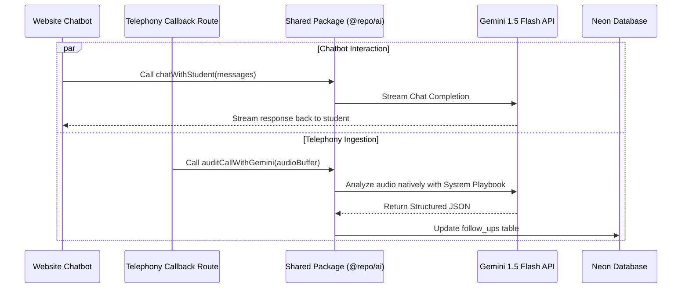

# SkillYards AI Architecture Design — Monorepo Shared AI Package

This document outlines the architectural plan to extract all Artificial Intelligence logic (including Call Auditing, Chatbots, and future RAG pipelines) into a dedicated shared package (`packages/ai`) inside the SkillYards Turborepo workspace.

---

## 1. Architectural Layout

Instead of embedding LLM logic directly inside individual applications, we encapsulate all generative AI configurations, system instructions, schemas, and model initializations inside a shared workspace package (`@repo/ai`).

```text
/home/chakresh/Skillyards/
├── apps/
│   ├── api/          # Imports @repo/ai for background call analysis
│   ├── admin/        # Imports @repo/ai for generating manual report triggers
│   └── website/      # (Future) Imports @repo/ai for client-facing student chatbot
├── packages/
│   ├── db/           # Shared database package (Drizzle schemas & Neon config)
│   └── ai/           # <--- Dedicated AI & Gemini Package
│       ├── package.json
│       ├── src/
│       │   ├── index.js             # Entry point (Exports all service handlers)
│       │   ├── call-analyzer.js     # Call auditing prompt & schema definitions
│       │   └── website-chatbot.js   # Chatbot agent persona & utility handlers
```

---

## 2. Detailed Data Flow



---

## 3. Architectural Critique & Trade-offs (Antigravity's Take)

Isolating AI logic into a shared monorepo package is a **highly mature architectural decision**, but it is important to analyze the advantages and limits honestly.

### Why this is a GREAT decision:
*   **Separation of Concerns & Code Hygiene**: AI prompt instructions, system guidelines, and structured schemas are large text block definitions. Keeping them out of API router files makes the routing code clean and highly readable.
*   **Prompt Single-Source-of-Truth**: If the marketing department changes course fees or sales pitch instructions, you only edit the prompt once inside `packages/ai`. Both the call auditor and the website chatbot automatically inherit the new rules.
*   **Dependency Isolation**: The `@google/genai` SDK is only installed in `packages/ai`. If you decide to upgrade to a newer version or migrate to another library in the future, you do not touch your core API configurations.

### What could be IMPROVED (Potential Risks & Limits):
1.  **Shared Process Limits (Next.js Serverless Execution)**:
    *   *The Issue*: When `apps/api` runs the auditing function in the background, it runs inside the Next.js process thread. If a call is 20 minutes long and takes time to process, serverless platforms (like Vercel or Netlify) might kill the execution thread due to timeout limits (typically 10s to 60s).
    *   *The Solution*: For very large audio uploads, we should trigger a background task runner (e.g. Inngest, BullMQ, or a Cron Job) to execute the audit rather than running it inline in a serverless route handler.
2.  **Environment Variable Propagation**:
    *   *The Issue*: `packages/ai` requires `GEMINI_API_KEY`. In a monorepo shared package, environment variables are loaded by the consuming app (`apps/api` or `apps/admin`).
    *   *The Solution*: We must explicitly configure the AI package constructor to accept the API key as an argument (dependency injection) or load it safely using `dotenv` inside the calling script.

---

## 4. Phased Implementation Roadmap

If we proceed with this architecture, here are the step-by-step action items:

### Phase 1: Package Initialization & Linking
1.  Create `/home/chakresh/Skillyards/packages/ai` folder.
2.  Configure its `package.json` with dependencies and package exports.
3.  Install `@google/genai` inside it.
4.  Reference `"@repo/ai": "workspace:*"` inside `apps/api/package.json` and `apps/admin/package.json`.

### Phase 2: Schema Migration
1.  Extend `packages/db/src/schema/followUps.js` with `aiStatus`, `transcription`, and `analysis` columns.
2.  Run migration generate and migration execution scripts.

### Phase 3: Writing AI Services
1.  Implement `call-analyzer.js` inside `packages/ai` with system playbooks and structured output schemas.
2.  Export the audit function from `packages/ai/src/index.js`.

### Phase 4: Route Hooking
1.  Import `@repo/ai` inside `apps/api/src/app/api/telephony/gsm-callback/route.js`.
2.  Run the auditing function asynchronously.
