# SkillYards AI Architecture Design — Independent AI Microservice

This document outlines the architecture, components, and data flow for all Artificial Intelligence workloads (currently Call Auditing, with planned expansions for Chatbots and RAG pipelines) inside a dedicated, isolated HTTP Microservice (`apps/ai-service`) in the SkillYards Turborepo workspace.

---

## 1. Monorepo Structural Layout

Instead of executing AI workloads inside serverless functions, which are subject to Vercel's 10-second execution limits, the AI workload is decoupled into a persistent, standalone Node.js Express server. This guarantees that long-running audio analysis calls are executed reliably without timeouts.

```text
/home/chakresh/Skillyards/
├── apps/
│   ├── api/          # Main API (Dispatches webhook triggers to AI Microservice)
│   ├── admin/        # Admin panel UI (Reads results from database; exposes manual audit trigger)
│   ├── website/      # Public website
│   └── ai-service/   # Standalone AI Microservice (Express API running on Port 3005)
│       ├── package.json
│       └── src/
│           ├── server.js            # Express server entry point, background queue processor
│           ├── call-analyzer.js     # Gemini Call analysis execution engine
│           ├── call-analyzer.config.js # Rubrics, KBs, SPIN/LACE maps, and JSON Schema
│           └── r2-client.js         # Cloudflare R2 S3 compatibility client
├── packages/
│   └── db/           # Shared database package (Drizzle schemas for Neon Postgres)
```
*(Note: `website-chatbot.js` is a planned routing extension for future development.)*

---

## 2. Dynamic Request & Data Flow

Below is the dynamic execution sequence. While call metadata is ingested instantly via the Android Call Tracker, auditing execution is triggered manually from the Admin panel UI to optimize API consumption.

```mermaid
sequenceDiagram
    participant App as Android Call Tracker
    participant API as Next.js API Server (Vercel)
    participant R2 as Cloudflare R2
    participant Admin as Admin Dashboard (Vercel)
    participant AISvc as AI Microservice (Port 3005)
    participant Gem as Gemini 2.5 Flash API
    participant DB as Neon Database

    %% Call Logging Phase
    App->>API: 1. POST /api/telephony/gsm-callback (Auth Secret + Audio Base64)
    API->>R2: 2. Upload raw audio file (.m4a/.mp3)
    API->>DB: 3. Insert call record (ai_status: 'pending')
    API-->>App: 4. Return success: true (Response in <1s)

    %% Auditing Trigger Phase
    Admin->>API: 5. POST /api/telephony/audit (Manually trigger audit from UI)
    API->>DB: 6. Update call record status (ai_status: 'pending')
    API->>AISvc: 7. POST /api/audit (Non-blocking HTTP Trigger)
    API-->>Admin: 8. Return success: true

    %% Async Microservice Processing Block
    rect rgb(20, 20, 30)
        Note over AISvc,DB: Asynchronous Queue Processing (No Vercel Timeouts)
        AISvc->>AISvc: 9. Push to internal memory queue (2s cooldown serialization)
        AISvc->>DB: 10. Update call record (ai_status: 'processing')
        AISvc->>R2: 11. Fetch audio file stream from bucket
        alt File Size < 10MB
            AISvc->>Gem: 12a. Send inline base64 audio data + prompt
        else File Size >= 10MB
            AISvc->>Gem: 12b. Upload to Gemini Files API (ai.files.upload)
            AISvc->>Gem: 13. Send File API reference + prompt
        end
        Gem-->>AISvc: 14. Return Structured Audit JSON
        alt File Size >= 10MB
            AISvc->>Gem: 15. Delete file reference (ai.files.delete)
        end
        AISvc->>DB: 16. Update follow_ups (transcription & analysis fields)
        AISvc->>DB: 17. Upsert results into call_analyses table
        AISvc->>DB: 18. Update call record (ai_status: 'completed')
    end
```



---

## 3. Architectural Components

### A. Asynchronous Task Queue (`apps/ai-service/src/server.js`)
*   **Memory Queue (`auditQueue`)**: Request triggers are immediately pushed to an in-memory queue. The HTTP endpoint `/api/audit` returns `202 Accepted` instantly to prevent connection timeouts.
*   **Serialized Processing**: An active loop (`processQueue`) pops tasks and runs them one by one.
*   **Rate-Limiting Cooldown**: Introduces a **2-second sleep/cooldown delay** after every audit to prevent rate-limit errors (`429`) or demand spikes on the Gemini API.

### B. Gemini 2.5 Flash Call Analyzer (`apps/ai-service/src/call-analyzer.js`)
*   **Modern SDK**: Built using the official `@google/genai` library (rather than legacy `@google/generative-ai` packages).
*   **Dynamic Audio Handling**:
    *   **Inline Data**: Files under 10MB are transformed into base64 strings and passed inline.
    *   **Files API**: Files 10MB or larger are written to local scratch storage, uploaded to the Gemini Files API, referenced during context execution, and cleaned up locally and remotely afterward.
*   **Model Integration**: Calls the `gemini-2.5-flash` model with `responseMimeType: "application/json"`.

### C. Comprehensive Rubric & Schema (`apps/ai-service/src/call-analyzer.config.js`)
The analysis operates on a strict schema and system prompt that verifies:
1.  **Knowledge Base Verification**: Audits claims against official details (On-Job Degree specializations, Career Accelerator options, DBRAU university association, and key trainers).
2.  **Strategic Cold Calling Stages**: Tracks adherence across 14 stages (Authority Intro, SPIN discovery, qualification questions, parent/payer identification, LACE objection handling, soft/strong CTA, urgency creation).
3.  **Linguistic & Grammar Quality**: Measures Hinglish/Hindi/English grammar scores, sentence framing quality (bad sentence construction), filler repetition counts, and redundant back-to-back translations.
4.  **Consultative Career Counseling**: Rates empathy, career pathway guidance (vs. pushy sales), monologue detection (flags counselor talk turns > 150 words), and student program alignment.
5.  **Compliance Checks**: Identifies absolute claims (e.g., "100% Job Guarantee", guaranteed internships/salaries, scarcity pressure) and assigns risk levels.

### D. Relational Database Logging (`packages/db`)
The results are mapped to two areas in the Neon PostgreSQL database:
1.  **`follow_ups` Table**: Keeps legacy fields (`transcription` and the raw `analysis` JSON) for compatibility. Updates status to `pending` ➔ `processing` ➔ `completed` / `failed`.
2.  **`call_analyses` Table**: Stores structured metrics natively for querying and filtering in the Admin dashboard:
    *   `overall_score` (Integer)
    *   `lead_grade` (Text, e.g., `A_hot`, `B_warm`, `C_cold`)
    *   `has_compliance_risk` (Boolean)
    *   JSON columns for `scores`, `compliance_flags`, `script_adherence`, `objections_raised`, `tone_and_delivery`, `coaching`, and `recommended_next_action`.

---

## 4. Why this is the Best Decision (Antigravity's Take)

Deploying a dedicated microservice solves the critical scaling and platform limitations of serverless environments:

1.  **Bypassing Vercel Execution Limits**:
    Vercel's hobby/pro tier terminates API executions after **10–60 seconds**. Auditing a longer sales recording using Gemini can take 15–30 seconds. Hosting `apps/ai-service` on a persistent server (like Render, Railway, or VPS) allows unlimited execution windows.
2.  **Resource Isolation**:
    Processing audio files and parsing massive JSON structures requires significant CPU and memory allocation. Isolating this load ensures the main REST API (`apps/api`) and dashboard (`apps/admin`) remain fully responsive and do not suffer from memory crashes.
3.  **Cost Efficiency**:
    You can deploy the main web app on Vercel for free, while deploying the small AI microservice to Render's free tier or a $5/month Railway/DigitalOcean server.
4.  **Future-Proof Extensibility**:
    Future features like the student chatbot (`POST /api/chat`) can stream responses directly from the persistent Express microservice, avoiding serverless connection limitations and maintaining seamless UI experiences.
