# SkillYards AI Architecture Design — Independent AI Microservice

This document outlines the architectural plan to implement all Artificial Intelligence workloads (Call Auditing, Chatbots, and future RAG pipelines) inside a dedicated, isolated HTTP Microservice (`apps/ai-service`) in the SkillYards Turborepo workspace.

---

## 1. Monorepo Structural Layout

Instead of importing AI logic as a shared library code inside serverless functions, the AI microservice runs as a persistent, standalone Node.js server. This allows it to bypass Vercel's 10-second execution limits and handle long audio audits securely.

```text
/home/chakresh/Skillyards/
├── apps/
│   ├── api/          # Main API (Dispatches lightweight webhooks to AI Microservice)
│   ├── admin/        # Admin panel UI (Reads results from Neon DB)
│   ├── website/      # Website frontend
│   └── ai-service/   # <--- NEW: Standalone AI Microservice (Express/Fastify API)
│       ├── package.json
│       ├── src/
│       │   ├── server.js            # Express server entry point (Port 3005)
│       │   ├── call-analyzer.js     # Gemini Call analysis engine
│       │   └── website-chatbot.js   # Chatbot student assistant routes
├── packages/
│   └── db/           # Shared database package (Neon Postgres & Drizzle schemas)
```

---

## 2. Dynamic Request & Data Flow

```mermaid
sequenceDiagram
    participant App as Android Call Tracker
    participant API as Next.js API Server (Vercel)
    participant R2 as Cloudflare R2
    participant AISvc as AI Microservice (Render/Railway/VPS)
    participant Gem as Gemini 1.5 Flash API
    participant DB as Neon Database

    App->>API: 1. POST /api/telephony/gsm-callback
    API->>R2: 2. Upload raw audio file (.m4a/.mp3)
    API->>DB: 3. Insert call record (ai_status: pending)
    API->>AISvc: 4. POST /api/audit (Non-blocking HTTP Trigger)
    API-->>App: 5. Return success: true (Response in <1s)

    rect rgb(20, 20, 30)
        Note over AISvc,DB: Asynchronous Heavy Auditing (No Vercel Timeouts)
        AISvc->>DB: Update call record (ai_status: processing)
        AISvc->>R2: Fetch audio stream from storage
        AISvc->>Gem: Send raw audio + Sales Playbook System Prompt
        Gem-->>AISvc: Return Structured Audit JSON
        AISvc->>DB: Write transcript, scores & mark ai_status: completed
    end
```



---

## 3. Why this is the Best Decision (Antigravity's Take)

Deploying a dedicated microservice solves the critical scaling and platform limitations of serverless environments:

1.  **Bypassing Vercel Execution Limits**:
    Vercel's free tier terminates API executions after **10 seconds**. Auditing a 5-minute call using Gemini takes 15–20 seconds. Hosting `apps/ai-service` on a persistent environment (like Render, Railway, or a VPS) allows unlimited execution windows.
2.  **Resource Isolation**:
    Processing audio files and parsing massive JSON objects requires CPU and RAM. Keeping this code in a separate process ensures your main API (`apps/api`) and dashboard (`apps/admin`) never experience latency spikes or memory crashes.
3.  **Deploying to Free/Cheap Servers**:
    You can deploy the main web app on Vercel for free, while deploying the small AI microservice to Render's free tier or a $5/month Railway/DigitalOcean server.
4.  **Extensible for Future Addons (e.g., Chatbot)**:
    When you build the student chatbot for your landing page, the chatbot will send messages directly to `POST apps/ai-service/api/chat`. The microservice will handle the stream back to the client, preventing any slowdown on your main application server.
