# Skillyards Backend — Architecture & System Design Guide

> **Version**: V1 (Secure-by-Default)
> **Last Updated**: April 26, 2026
> **Status**: Production

---

## Table of Contents


1. [System Overview](#1-system-overview)
2. [Infrastructure & Deployment](#2-infrastructure--deployment)
3. [Monorepo Structure](#3-monorepo-structure)
4. [Database Layer](#4-database-layer)
5. [Security Architecture](#5-security-architecture)
6. [Domain Modules](#6-domain-modules)
7. [Distributed PDF Generation](#7-distributed-pdf-generation)
8. [External Integrations](#8-external-integrations)
9. [Data Flow Walkthroughs](#9-data-flow-walkthroughs)
10. [Key Design Decisions & Rationale](#10-key-design-decisions--rationale)

---

## 1. System Overview

Skillyards is a **multi-application ERP platform** for an educational institution. It manages student enrollment, fee collection, installment planning, receipt generation, lead capture, and online assessments.

### Architecture at a Glance

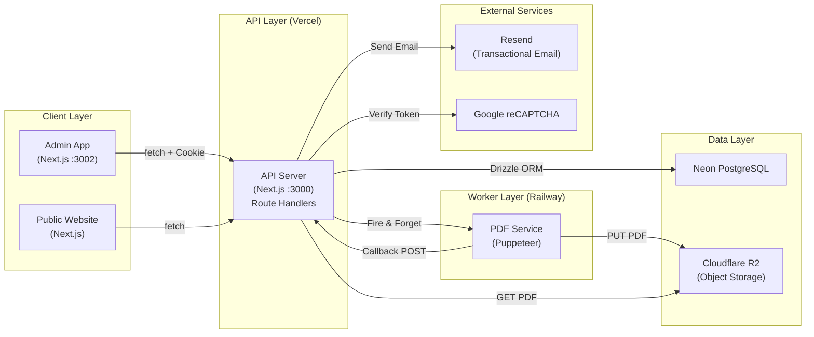

### Technology Stack

| Layer | Technology | Purpose |
|---|---|---|
| **API Runtime** | Next.js 16.1.6 (Turbopack) | API Route Handlers, server-side logic |
| **ORM** | Drizzle ORM 0.45 | Type-safe SQL query builder |
| **Database** | Neon PostgreSQL (Serverless) | Serverless Postgres with HTTP driver |
| **Object Storage** | Cloudflare R2 (S3-compatible) | PDF receipt storage |
| **PDF Generation** | Puppeteer (Railway Worker) | Headless Chrome HTML→PDF conversion |
| **Email** | Resend | Transactional email delivery |
| **Auth** | jose (JWT HS256) | Stateless session management |
| **Validation** | Zod | Runtime schema validation |
| **CAPTCHA** | Google reCAPTCHA v2 | Bot protection for public forms |

---

## 2. Infrastructure & Deployment

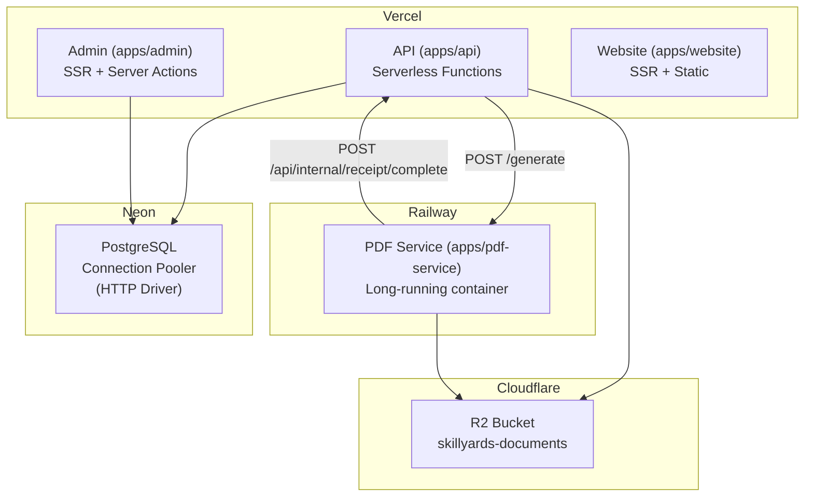

### Why This Split?

- **Vercel** hosts the API and admin app as serverless functions. They have a ~30s execution limit.
- **Railway** hosts the PDF service as a long-running container because Puppeteer needs a persistent headless Chrome instance and can exceed serverless timeouts.
- **Neon HTTP Driver** (`@neondatabase/serverless`) is used instead of a TCP connection, which is required for Vercel's edge/serverless environment.

### Environment Variables (API)

| Variable | Purpose |
|---|---|
| `DATABASE_URL` | Neon PostgreSQL connection string |
| `JWT_SECRET` | HMAC key for JWT signing/verification |
| `R2_ACCESS_KEY`, `R2_SECRET_KEY`, `R2_ENDPOINT`, `R2_BUCKET` | Cloudflare R2 credentials |
| `PDF_SERVICE_URL` | Railway PDF service endpoint |
| `PDF_SERVICE_API_KEY` | Shared secret for internal service auth |
| `RESEND_API_KEY` | Resend transactional email API key |
| `RECAPTCHA_SECRET_KEY` | Google reCAPTCHA server-side secret |
| `EMAIL_FROM`, `ADMIN_EMAIL` | Email sender/recipient configuration |

---

## 3. Monorepo Structure

```
Skillyards/
├── apps/
│   ├── api/                    # Next.js API Server (Port 3000)
│   │   └── src/
│   │       ├── app/api/        # Next.js Route Handlers
│   │       ├── lib/            # Auth, Middleware, Permissions, CORS
│   │       ├── modules/        # Domain modules (Service/Repo/Schema)
│   │       ├── integrations/   # External service clients (PDF, CAPTCHA)
│   │       └── utils/          # Shared utilities
│   ├── admin/                  # Next.js Admin Dashboard (Port 3002)
│   ├── website/                # Public-facing website
│   ├── pdf-service/            # Puppeteer PDF worker (Railway)
│   ├── cms/                    # Content Management
│   └── erp/                    # ERP module
├── packages/
│   └── db/                     # Shared database package (@repo/db)
│       └── src/
│           ├── client.js       # Neon + Drizzle client
│           ├── index.js        # Re-exports
│           └── schema/         # All table definitions
└── docs/                       # Documentation
```

### Module Pattern (Service → Repository → Schema)

Every domain module follows a strict 3-layer architecture:

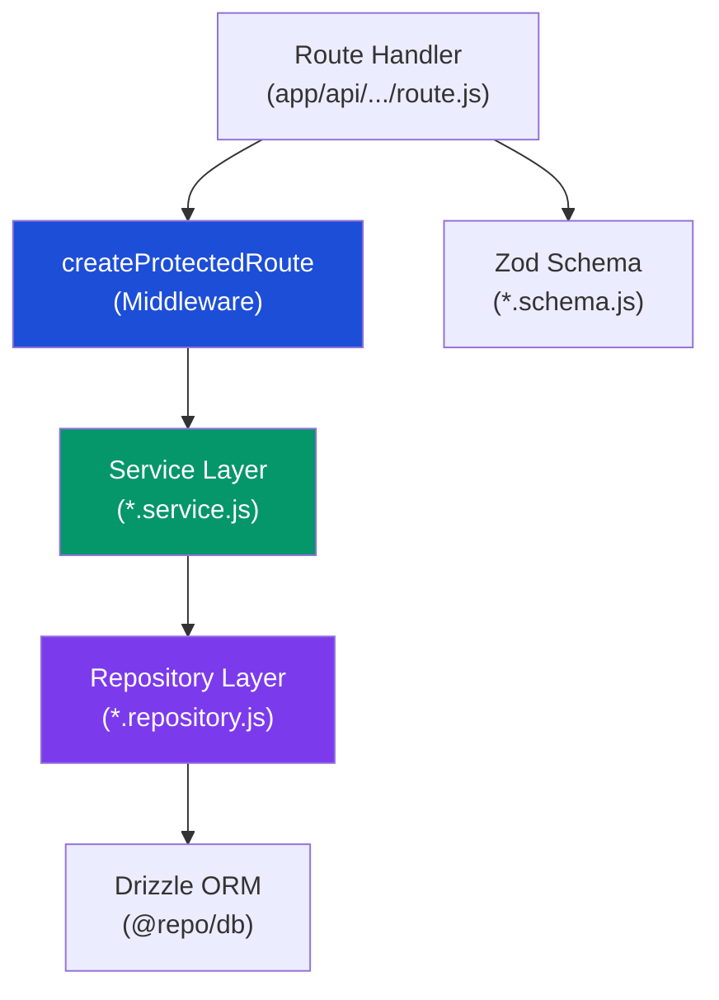

| Layer | Responsibility | Example |
|---|---|---|
| **Route Handler** | HTTP concerns (request parsing, response formatting) | `app/api/students/route.js` |
| **Middleware** | Auth, authz, rate limiting, correlation, resource loading | `lib/middleware.js` |
| **Service** | Business logic, orchestration, validation | `modules/students/student.service.js` |
| **Repository** | Raw database queries (Drizzle ORM) | `modules/students/student.repository.js` |
| **Schema** | Zod validation schemas | `modules/students/student.schema.js` |

---

## 4. Database Layer

### Connection Setup

```javascript
// packages/db/src/client.js
import { neon } from "@neondatabase/serverless";
import { drizzle } from "drizzle-orm/neon-http";

const sql = neon(process.env.DATABASE_URL);
export const db = drizzle(sql, { schema });
```

Uses Neon's **HTTP driver** for serverless-compatible, connection-pooled access.

### Entity-Relationship Diagram

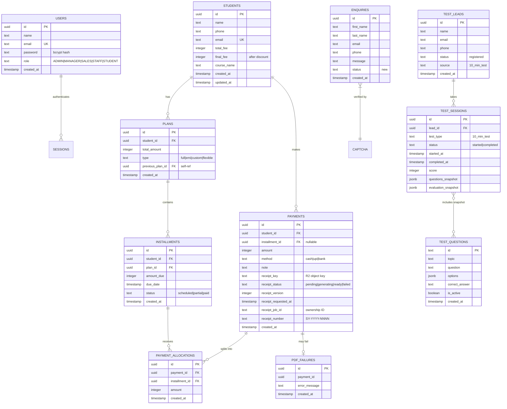

### Key Database Indexes

| Table | Index | Purpose |
|---|---|---|
| `payments` | `payments_student_id_idx` | Fast student payment lookups |
| `payments` | `payments_installment_id_idx` | Fast installment→payment joins |
| `payments` | `payments_receipt_number_idx` | Unique receipt number queries |
| `installments` | `installments_student_id_idx`, `installments_plan_id_idx` | Student/Plan lookups |
| `payment_allocations` | `alloc_payment_id_idx`, `alloc_installment_id_idx` | Allocation joins |
| `plans` | `plans_student_id_idx` | Student plan lookups |

---

## 5. Security Architecture

### 5.1 Structural Enforcement Wrapper (`createProtectedRoute`)

Every API route is wrapped in `createProtectedRoute`, a **centralized middleware** that enforces security in a strict order:

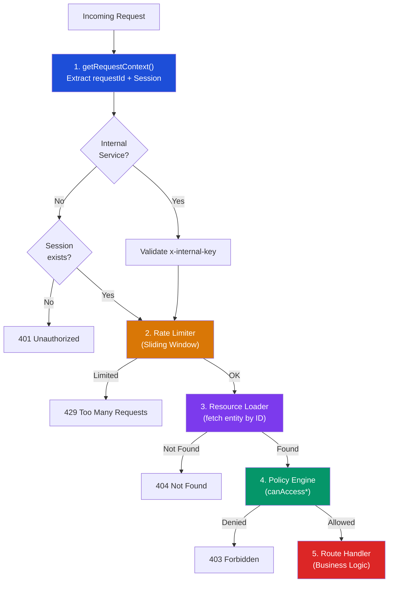


### 5.2 Authentication (JWT + Cookie)

```
Admin Login → encrypt(payload) → Set-Cookie: session=<JWT>
                                  httpOnly, secure, sameSite=lax
                                  domain=.skillyards.in (prod)

API Request → Cookie: session=<JWT> → jwtVerify(token, HS256) → session payload
```

- **Algorithm**: HS256 (HMAC-SHA256)
- **Library**: `jose`
- **Expiry**: 7 days
- **Storage**: httpOnly cookie (prevents XSS theft)
- **Cross-origin**: Admin app forwards session cookie via `getAuthHeaders()` in all server-side fetches

### 5.3 Authorization (Role-Based Policy Engine)

| Role | Access Level |
|---|---|
| **ADMIN** | Full system access, master override on all resources |
| **MANAGER** | Same as ADMIN (full override) |
| **SALES** | Restricted in V1 (`SALES_UNASSIGNED_DENY`), V2 will add student assignment |
| **STAFF** | Default role, restricted access |
| **STUDENT** | Ownership-based only (can view own records) |
| **INTERNAL** | Service-to-service auth via `x-internal-key` header |

Policy functions:

- `canAccessStudent(session, student)` — Used by all `/api/students/*` routes
- `canAccessReceipt(session, payment)` — Used by `/api/payments/[id]/receipt`
- `canAccessEnquiry(session)` — Used by `/api/enquiries`
- `canAccessAssessment(session)` — Used by `/api/test/*`
- `internalServiceOnly(session, resource, req)` — Used by `/api/internal/*`
- `publicAllow()` — Used by public routes

### 5.4 Rate Limiting (Sliding Window)

```
Window: 15 seconds
Burst Limit: 3 requests per key per window
Key Format: "{userId}:{resourceId}" or "anon:{url}"
Storage: In-memory Map (global variable, survives hot-reloads)
Max Keys: 5,000 (auto-cleanup of expired entries)
```

### 5.5 Request Correlation

Every request gets a `requestId` (either from `x-request-id` header or auto-generated UUID). All log entries include this ID for end-to-end tracing:

```
[31e846fa-8dd1-452a-aae4-42311a2fb9a0] AUTHZ_DECISION { userId: "...", role: "ADMIN", result: "ALLOW" }
```

### 5.6 CORS

Handled by `utils/cors.js`. Allowed origins are:
- `skillyards.in`, `www.skillyards.in`, `admin.skillyards.in`
- Vercel preview URLs
- `localhost:3000`, `localhost:3001`, `localhost:3002`

Credentials are allowed (`Access-Control-Allow-Credentials: true`).

---

## 6. Domain Modules

### 6.1 Students Module

**Files**: `modules/students/student.service.js`, `student.repository.js`, `student.schema.js`

**Routes**:
| Method | Path | Handler | Policy |
|---|---|---|---|
| GET | `/api/students` | List all students with payment totals | `canAccessStudent` |
| POST | `/api/students` | Create student (Zod validated) | `canAccessStudent` |
| GET | `/api/students/[id]` | Mega-fetch: student + ledger + plan + transactions | `canAccessStudent` |
| GET | `/api/students/stats` | Dashboard aggregates | `canAccessStudent` |

**`getStudentDetail` — Parallel Mega-Fetch**:

```javascript
const [student, payments, ledger, plan] = await Promise.all([
    getStudentById(db, studentId),
    getPaymentsWithAllocations(db, studentId),      // payments + allocations
    getStudentLedger(db, studentId),                  // totalDue, totalPaid, pending
    getPlanWithInstallments(db, studentId)             // plan + installments
]);
```

This fires **4 independent queries in parallel** for maximum performance.

**Validation Schema**:
- `name`: required, 1-100 chars
- `phone`: optional, max 10 digits
- `email`: optional, valid email
- `totalFee`: required, positive integer
- `finalFee`: required, positive integer, must be ≤ `totalFee`

---

### 6.2 Plans Module

**Files**: `modules/plans/plan.service.js`, `plan.repository.js`, `plan.schema.js`

**Routes**:
| Method | Path | Handler |
|---|---|---|
| GET | `/api/students/[id]/plan` | Get plan with installments |
| POST | `/api/students/[id]/plan` | Create plan with installments |
| POST | `/api/students/[id]/plan/installments` | Add flexible installment |

**4 Plan Types**:

| Type | Behavior |
|---|---|
| `full` | Single installment = full amount, due immediately |
| `emi` | Equal monthly installments (auto-calculated), last one absorbs remainder |
| `custom` | User-defined amounts per installment, sum must equal total |
| `flexible` | User-defined amounts, sum can be less than total (remaining can be added later) |

**Flexible Installment Addition**:
- Only works on `flexible` plans
- Validates `amount ≤ remaining balance`
- Creates a new installment attached to the existing plan

---

### 6.3 Payments Module

**Files**: `modules/payments/payment.service.js`, `payment.repository.js`, `payment.schema.js`, `ledger.service.js`, `receipt.service.js`

**Routes**:
| Method | Path | Handler |
|---|---|---|
| GET | `/api/students/[id]/payments` | List payments with allocations |
| POST | `/api/students/[id]/payments` | Create payment (auto-allocate) |
| GET | `/api/payments/[id]` | Get single payment |
| GET | `/api/payments/[id]/receipt` | Get/generate receipt (HTML or PDF) |
| GET | `/api/students/[id]/ledger` | Get financial ledger |

**Auto-Allocation Algorithm** (`addPayment`):

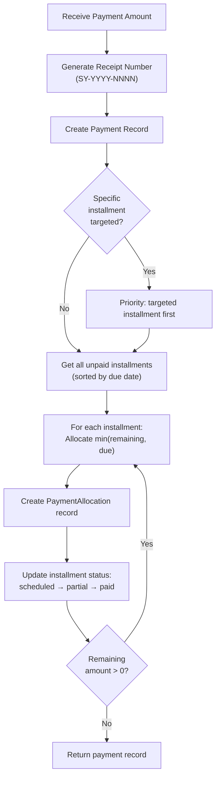

**Ledger Service** (`getStudentLedger`):
- Computes `totalDue` (from plan), `totalPaid` (from payments), `pending`, and `credit` (overpayment)
- Uses `Promise.all` for parallel queries

**Receipt Number Format**: `SY-{YEAR}-{4-digit sequential}` (e.g., `SY-2026-0042`)

---

### 6.4 Enquiries Module

**Files**: `modules/enquiries/enquiry.service.js`, `enquiry.repository.js`, `enquiry.schema.js`

**Route**: `POST /api/enquiries` (public, reCAPTCHA-protected)

**Flow**:
1. Verify reCAPTCHA token (bypassed in development)
2. Insert enquiry into database
3. Send admin notification email (non-blocking)
4. Send user confirmation email (non-blocking)
5. Email failures do not break the API response

---

### 6.5 Notifications Module

**Files**: `modules/notifications/email.service.js`, `email.template.js`, `resend.client.js`

- Uses **Resend** for transactional email
- `sendAdminEnquiryNotification()` — notifies staff of new leads
- `sendUserConfirmation()` — acknowledges user's enquiry
- HTML email templates are generated inline via template literals

---

### 6.6 Assessment (Test) Module

**Files**: `modules/test/test.service.js`, `test.repository.js`, `test.schema.js`, `certificate.service.js`, `certificate.template.js`

**Routes**:
| Method | Path | Purpose |
|---|---|---|
| POST | `/api/test/register` | Register lead for test |
| POST | `/api/test/start` | Start/resume test session |
| POST | `/api/test/submit` | Submit answers, auto-grade |
| POST | `/api/test/validate` | Validate session |
| GET | `/api/test/questions` | Fetch questions |
| GET | `/api/test/result` | Fetch results |

**Test Flow**:

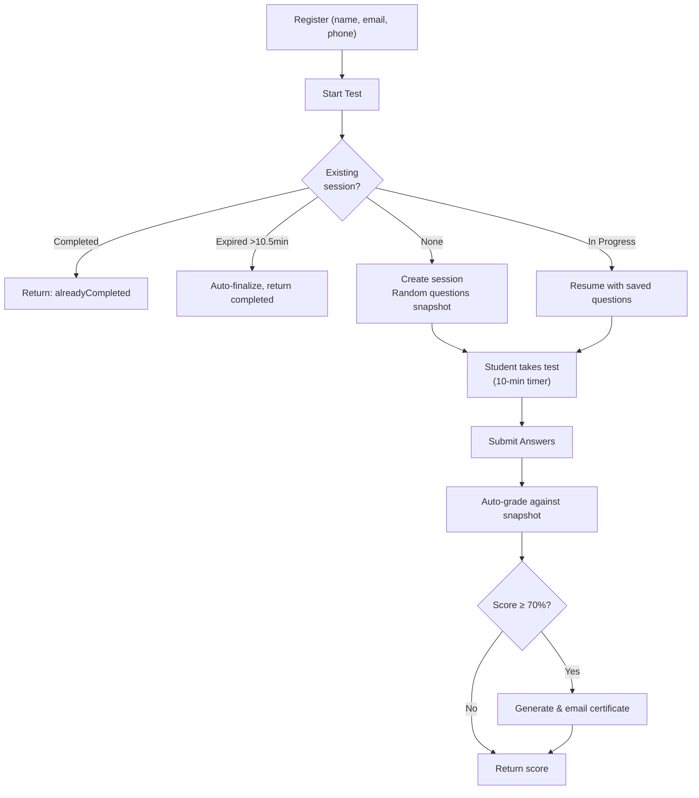

**Key Design Decisions**:
- Questions are **snapshotted** at session start (stored in `jsonb`) so grading is immune to question edits
- `correctAnswer` is stripped from the frontend payload but kept in the DB snapshot
- Sessions auto-expire after 10.5 minutes
- Certificate generation is fire-and-forget (errors don't break the response)

---

## 7. Distributed PDF Generation

The PDF system is the most architecturally complex subsystem. It uses an **asynchronous, distributed** pattern.

### Architecture

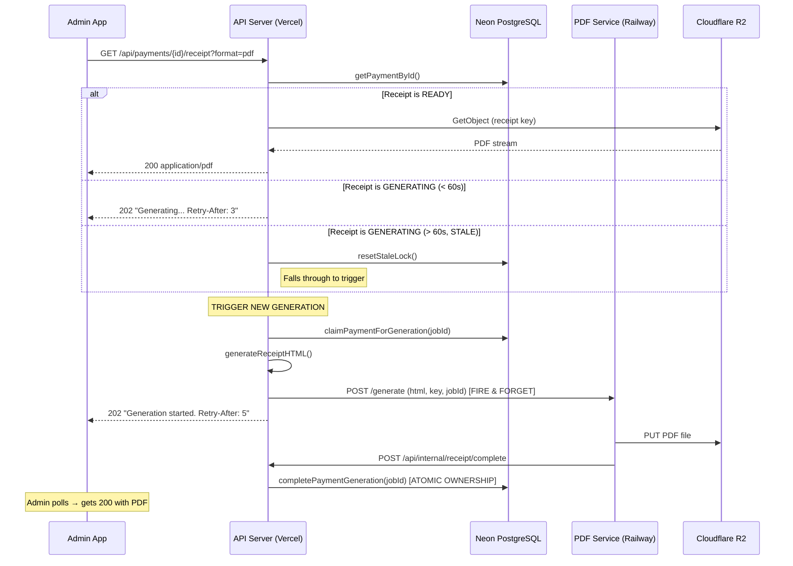

### Receipt Status State Machine

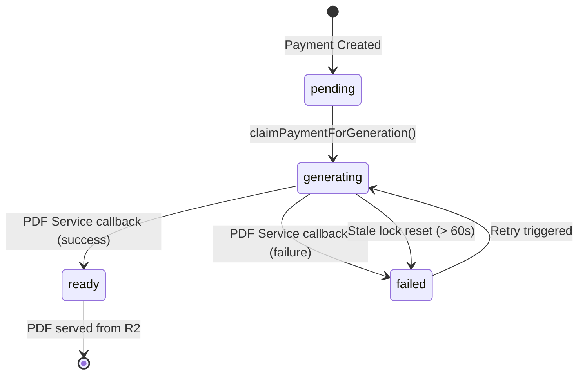

### Concurrency & Ownership Protection

- **`receiptJobId`**: A UUID assigned when generation is claimed. The callback must present the same `jobId` to update the record. This prevents **race conditions** where a stale callback from a previous attempt overwrites a newer generation.
- **Atomic claim**: Uses a `WHERE ... AND receipt_status != 'generating'` clause to prevent double claims.
- **Stale recovery**: If a job has been "generating" for > 60 seconds, it's considered stale and the lock is reset.

### Internal Service Authentication

The callback endpoint (`/api/internal/receipt/complete`) uses a **separate auth path**:
- Validates `x-internal-key` header against `PDF_SERVICE_API_KEY`
- Bypasses JWT/cookie authentication entirely
- Uses the `internalServiceOnly` flag in `createProtectedRoute`

---

## 8. External Integrations

### 8.1 Cloudflare R2 (Object Storage)

- **Client**: AWS S3 SDK (`@aws-sdk/client-s3`) with `forcePathStyle: true`
- **Bucket**: `skillyards-documents`
- **Key Pattern**: `receipts/v{version}/{paymentId}.pdf`
- **Usage**: Store generated PDF receipts, serve via `GetObjectCommand`

### 8.2 Resend (Transactional Email)

- **Purpose**: Enquiry notifications and user confirmations
- **From**: `admin@skillyards.in`
- **Templates**: Inline HTML generated by `email.template.js`
- **Error Handling**: Non-blocking (email failures don't break API responses)

### 8.3 Google reCAPTCHA

- **Purpose**: Protect public enquiry form from bots
- **Type**: Server-side verification via `siteverify` endpoint
- **Dev Mode**: Automatically bypassed in development (`NODE_ENV === "development"`)

### 8.4 PDF Service (Railway)

- **Trigger**: `POST {PDF_SERVICE_URL}/generate` with `{ html, key, jobId }`
- **Auth**: `x-internal-key` header
- **Callback**: `POST /api/internal/receipt/complete` with `{ paymentId, jobId, status, key }`
- **Hosting**: Railway (long-running container for Puppeteer)

---

## 9. Data Flow Walkthroughs

### 9.1 Student Enrollment → Fee Plan → Payment → Receipt

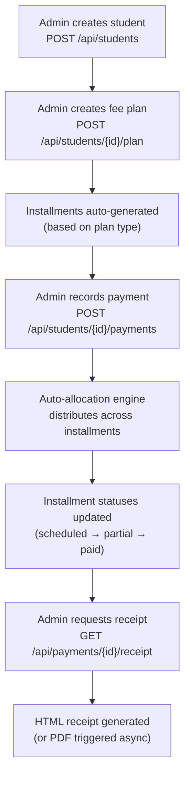

### 9.2 Public Enquiry Flow

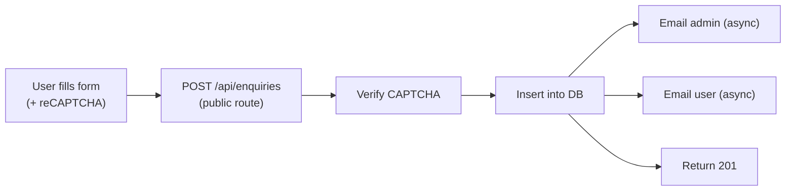

### 9.3 Assessment Test Flow

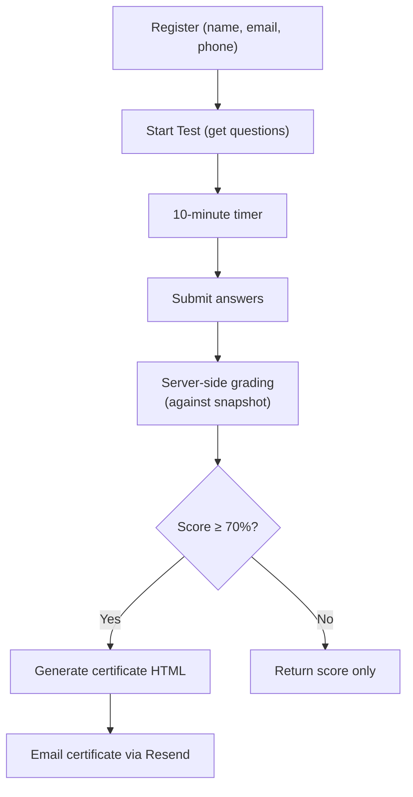

---

## 10. Key Design Decisions & Rationale

### Why Next.js for an API?

The monorepo uses Next.js for all applications (website, admin, API) to maintain **a single toolchain**. The API uses Next.js Route Handlers exclusively — no React rendering.

### Why Drizzle over Prisma?

Drizzle's **SQL-like query builder** gives more control and produces predictable queries. It also works natively with Neon's HTTP driver, which is critical for serverless deployment on Vercel.

### Why Separate PDF Service?

PDF generation via Puppeteer requires:
1. A **headless Chrome instance** (~200MB memory)
2. **10-25 seconds** of execution time
3. A **persistent process** (no cold starts)

Vercel serverless functions have a 30s timeout and no filesystem persistence, making Puppeteer unreliable. Railway provides a long-running container.

### Why Fire-and-Forget + Callback?

The API doesn't `await` the PDF service response. Instead:
1. API triggers generation and immediately returns `202 Accepted`
2. PDF service generates the PDF, uploads to R2, and calls back
3. The callback atomically updates the payment record

This decouples the user-facing response time from the PDF generation time.

### Why In-Memory Rate Limiting?

For a single-instance serverless function, an in-memory sliding window is simpler and faster than a Redis-based solution. It uses `global` to persist across hot-reloads in development. The trade-off is that rate limiting resets on cold starts, which is acceptable for the current traffic volume.

### Why Zod for Validation?

Zod provides **runtime type safety** at the API boundary. It catches malformed requests before they reach the service layer, producing structured error messages that the frontend can display.

### Why Questions Snapshot in JSONB?

Test questions are snapshotted into the session record at test start. This ensures that:
- Grading is **deterministic** even if questions are later edited or removed
- The `correctAnswer` field is preserved server-side but stripped from the client payload
- The evaluation snapshot provides a permanent audit trail

---

*This document is the authoritative reference for the Skillyards backend architecture. For V2 scope and roadmap, see [V2_SCOPE_AND_TODOS.md](../V2_SCOPE_AND_TODOS.md).*

