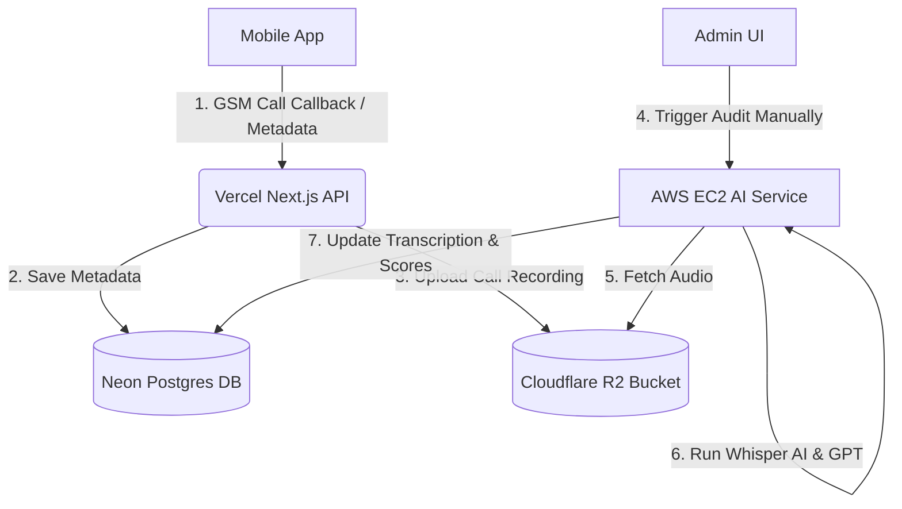

# Call Tracker & AI Service Deployment Guide

This guide details the architecture, setup, environment configurations, and maintenance procedures for the Skillyards Call Tracker and AI Auditing Service.

---

## 1. System Architecture



---

## 2. Key Environment Variables

### Vercel (`api` Project Settings)
* **`CALL_TRACKER_SECRET`**: `f8fe36033866cd8b2630e77a3322784d` (Used to authenticate the mobile app callback requests).
* **`AI_SERVICE_URL`**: `http://54.196.130.80:3005` (Endpoints where the manual audit button routes requests).
* **`DATABASE_URL`**: Neon database connection string.

### AWS EC2 (`ai-service` `.env`)
* **`PORT`**: `3005`
* **`DATABASE_URL`**: Same Neon database connection string.
* **`R2_ACCESS_KEY`** & **`R2_SECRET_KEY`**: Cloudflare keys.
* **`R2_ENDPOINT`**: Cloudflare R2 endpoint URL.

---

## 3. Database Schema Migration

The central `follow_ups` table has been migrated to map calls directly to the **`users`** table instead of the deprecated `employees` table:

```sql
ALTER TABLE "follow_ups" 
DROP CONSTRAINT "follow_ups_telecaller_id_employees_id_fk",
ADD CONSTRAINT "follow_ups_telecaller_id_users_id_fk" 
FOREIGN KEY ("telecaller_id") REFERENCES "users"("id") ON DELETE CASCADE;
```

> [!IMPORTANT]
> Because of this constraint, any incoming payload containing a `telecaller_id` that is **not** present in the `users` table will trigger a database integrity error.

### Legacy Client-Side Compatibility (Deduplication & Translation)
To support older mobile app versions that still have old employee UUIDs stored in their offline queue, the endpoint `apps/api/src/app/api/telephony/gsm-callback/route.js` includes:
1. **Deduplication Check**: Prevents logging duplicate records if the same telecaller calls the same number within a `10-second` window.
2. **Translation Mapping**: Translates old employee IDs to new user IDs (e.g., Saurabh Verma's old ID maps to his new user UUID).
3. **Graceful Skip**: If a user is deactivated or invalid, the API responds with `200 OK` (with a warning message) instead of `500` to allow the mobile app to purge the stuck record from its cache.

---

## 4. AWS EC2 Server Management (`54.196.130.80`)

The AI Auditing microservice runs on a `t3.micro` instance in AWS EC2.

### Connecting to the Instance
Run this command from your local machine's `Downloads` folder (where the keyfile is located):
```bash
ssh -i skillyards-key.pem ubuntu@54.196.130.80

# Or to bypass strict host checking:
ssh -o StrictHostKeyChecking=no -i skillyards-key.pem ubuntu@54.196.130.80
```

### Server Swap Space Configuration
Because the server is a `t3.micro` (1GB RAM), **2GB of swap space** has been configured to prevent out-of-memory compilation crashes. 

---

## 5. PM2 Process Management

PM2 is used to run the `ai-service` as a background daemon and keep it alive on reboot.

### Useful Commands (Run on the EC2 Server):

* **Check status of services**:
  ```bash
  pm2 status
  ```
* **View real-time logs**:
  ```bash
  pm2 logs ai-service
  ```
* **Restart the service (after pulling new code)**:
  ```bash
  pm2 restart ai-service
  ```
* **View historical output logs**:
  ```bash
  cat ~/.pm2/logs/ai-service-out.log
  ```
* **View historical error logs**:
  ```bash
  cat ~/.pm2/logs/ai-service-error.log
  ```

---

## 6. How to Deploy Updates

When you make changes to the codebase and want to deploy them:

### Local Machine:
1. Commit and push your changes to your remote Git repository:
   ```bash
   git add .
   git commit -m "your commit message"
   git push origin main
   ```
2. Vercel will automatically redeploy the Frontend and API.

### AWS EC2:
1. SSH into the server:
   ```bash
   ssh -i skillyards-key.pem ubuntu@54.196.130.80
   # Or:
   ssh -o StrictHostKeyChecking=no -i skillyards-key.pem ubuntu@54.196.130.80
   ```
2. Pull the latest code and restart PM2:
   ```bash
   cd ~/skillyards
   git pull
   pm2 restart ai-service
   ```

---

## 7. Troubleshooting Common Errors

| Error Code / Symptom | Root Cause | Solution |
| :--- | :--- | :--- |
| **404 Page Not Found** | Mobile App configured with doubled suffix (e.g., `/api/telephony/gsm-callback/api/telephony/gsm-callback`). | Configure the mobile app URL to just: `https://api.skillyards.in` (without the trailing path). |
| **403 Forbidden** | `x-app-secret` header mismatch or missing `CALL_TRACKER_SECRET` on Vercel. | Ensure Vercel project environment variables match the mobile app secret (`f8fe36033866cd8b2630e77a3322784d`). |
| **500 Database logging failed** | `telecaller_id` not found in `users` table or database query failed. | Add the missing user to the `users` table or update the `EMPLOYEE_TO_USER_MAP` translation array in `route.js`. |
| **SocketTimeoutException** | Temporary mobile data drop or poor connection on the physical phone. | Verify phone network connectivity. The app's `WorkManager` scheduler will automatically retry and sync once the connection is stable. |
