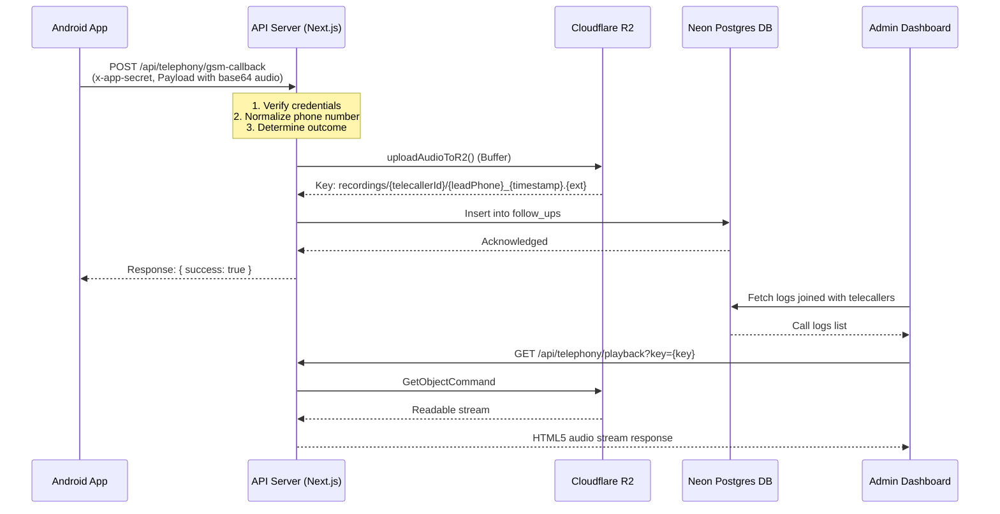

# SkillYards Call Tracker Integration Status

This document details the architecture, implemented components, and next steps for the Android Call Tracker integration into the SkillYards CRM platform.

---

## 1. Architectural Overview

The integration establishes a robust data ingestion pipeline that logs calls from an Android tele-calling app, uploads recordings to Cloudflare R2, and presents call logs in the SkillYards Admin Panel.

---

## 2. Completed Items

### A. Database Layer
*   **Table Schema**: Added a new schema `followUps` in `packages/db/src/schema/followUps.js` and exported it in `packages/db/src/schema/index.js`.
*   **Database Table (`follow_ups`)**:
    *   `id`: `uuid` (Primary Key, Default: random)
    *   `lead_phone`: `text` (Normalized 10-digit number)
    *   `telecaller_id`: `uuid` (Foreign Key referencing `users.id` with `ON DELETE CASCADE`)
    *   `duration`: `integer` (Duration in seconds)
    *   `recording_url`: `text` (Key to R2 recording object)
    *   `outcome`: `text` (`reached` if duration > 15 seconds, otherwise `not_reached`)
    *   `type`: `text` (Default: `call`)
    *   `contacted_at`: `timestamp` (Start time of the call)
    *   `created_at`: `timestamp` (Insertion time, Default: now)
*   **Migration**: Migration generated and executed successfully using `@neondatabase/serverless` on the live Postgres database.

### B. Ingestion API Endpoint
*   **Route**: Created `apps/api/src/app/api/telephony/gsm-callback/route.js`.
*   **Features**:
    *   Verifies authorization using the `x-app-secret` header against `CALL_TRACKER_SECRET`.
    *   Normalizes the dialed number to a standard 10-digit format (clearing country codes or invalid characters).
    *   Converts `recording_base64` payload into binary buffer.
    *   Uploads buffer to R2 with auto-derived MIME types (`audio/x-m4a` for `.m4a`, `audio/wav` for `.wav`, `audio/mpeg` for others).
    *   Inserts record into `follow_ups` cleanly (even if audio upload fails, the metadata remains logged).

### C. R2 Storage Integration
*   **Client Upload Function**: Added `uploadAudioToR2` in `apps/api/src/integrations/r2/r2.client.js` to upload raw binary buffers using the `@aws-sdk/client-s3` library.
*   **Audio Streaming Proxy**: Implemented `GET /api/telephony/playback` in `apps/api/src/app/api/telephony/playback/route.js` to stream recordings using native browser range request headers.

### D. Admin Dashboard Interface
*   **Sidebar Link**: Added a "Calls" nav item to `apps/admin/src/components/layout/Sidebar.jsx`.
*   **Call Logs page**: Implemented a server-rendered container at `apps/admin/src/app/(authenticated)/calls/page.js` protecting it for `ADMIN` and `MANAGER` roles only.
*   **Interactive Call table**: Implemented `apps/admin/src/app/(authenticated)/calls/calls-client.js`:
    *   Filtering by outcome (Reached / Not Reached).
    *   Search by caller name or phone number.
    *   **Floating Global Audio Player**: Sticky audio player bar triggered by clicking "Listen" next to any logged call, allowing seamless page interaction during playback.

## 3. What is Missing (Required Actions & Next Steps)

### A. Local & Production Deployment Configuration
While environment variables are configured in the local `apps/api/.env` file, they must be copied and configured in the production hosting provider (e.g. Vercel, Railway, or AWS):
*   `CALL_TRACKER_SECRET`: Required for mobile client authorization.
*   `R2_ACCESS_KEY`, `R2_SECRET_KEY`, `R2_ENDPOINT`, `R2_BUCKET`: Required for audio uploads.
*   `NEXT_PUBLIC_API_URL` (in `apps/admin/.env`): Required so the admin dashboard audio player points to the correct API base URL.

### B. Mobile App Hook Configuration
The mobile app developer needs to configure the app's outbound call tracker client:
1. Set endpoint URL: `https://<api-domain>/api/telephony/gsm-callback`
2. Add header: `x-app-secret` with the value of `CALL_TRACKER_SECRET`.

### C. Missing CRM Integrations (Next Steps)
To fully integrate call logging into the sales team workflow:
1.  **Call History on Enquiries Dialog**:
    *   Currently, call logs can only be viewed globally on the `/calls` page.
    *   *Next Step*: Embed a "Call History" panel inside the Enquiry Details dialog on the Enquiries page. When a sales agent opens an enquiry, it should display all calls made to that lead's phone number, complete with durations and inline play buttons.
2.  **Lead Association**:
    *   Extend the `follow_ups` schema to optionally store an `enquiry_id` (foreign key to `enquiries.id`), which gets linked automatically if the phone number matches an existing lead.

### D. Testing & End-to-End Validation
*   We need a simulation script to mock the Android application payload (transmitting a mock base64 audio string and metadata) to verify the ingestion, R2 storage upload, and database logging function perfectly.

