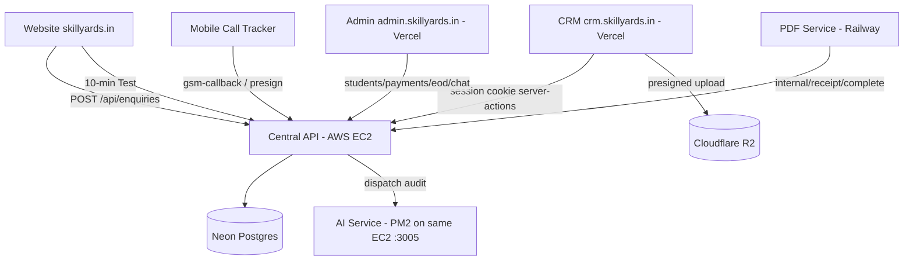

# SkillYards CRM & AWS Migration Guide

This guide documents the plan, architecture, and step-by-step implementation for two coupled initiatives:

1.  **Building the CRM** — a dedicated sales-hub app (`crm.skillyards.in`) that owns **Leads (Enquiries), Calls, and Counselling**, scoped out of the admin panel.
2.  **Moving the central API to AWS** — relocating the Next.js API from Vercel to the existing AWS EC2 instance (`54.196.130.80`) using Docker Compose, co-located with the AI auditing service.

---

## 1. Target Architecture



| Component | Host | Notes |
| :--- | :--- | :--- |
| CRM UI | Vercel (`crm.skillyards.in`) | Stateless consumer of the API; shares `.skillyards.in` session cookie |
| Central API | AWS EC2 `54.196.130.80` | Docker Compose: `api` (Next.js standalone) + `caddy` (TLS) |
| AI Service | Same EC2, **stays in PM2** (`:3005`) | Reached by the API container via `host.docker.internal` |
| Database | Neon Postgres | Unchanged |
| Object Storage | Cloudflare R2 | Unchanged (recordings, receipts, images, avatars) |
| Admin (post-cutover) | Vercel | Sheds enquiries / calls / counselling; keeps students, payments, EOD, chat, users |
| PDF Service | Railway | Unchanged; callback hostname `api.skillyards.in` stays the same |

---

## 2. Guiding Decisions (locked)

1.  **CRM role**: Sales hub for leads. SALES/BDAs work the funnel; ADMIN/MANAGER supervise.
2.  **Permissions**: SALES see a **shared lead pool** (read + status update) and their **own** calls/counselling; ADMIN/MANAGER see everything.
3.  **Data ownership**: The central API is the single owner of sales data. The CRM never touches the DB directly.
4.  **Lead contract**: New `GET /api/leads` (merged website-enquiries + test leads); `PATCH /api/enquiries` for status; public `POST /api/enquiries` stays for the website.
5.  **API hosting**: Existing EC2 instance, Docker Compose (`api` + `caddy`), AI service untouched in PM2.
6.  **Deploy**: GitHub Actions builds the image → pushes to GHCR → SSH → `drizzle-kit push` → `docker compose up -d`.
7.  **Data layer**: Neon + R2 retained. No RDS/S3 migration.
8.  **DNS**: `api.skillyards.in` A-record → EC2 IP. Hostname unchanged, so mobile app, website, admin, PDF callback, and the EOD cron keep working.

---

## 3. Phase 1 — Extend the Central API

### 3.1 `GET /api/leads` (new)

Route: `apps/api/src/app/api/leads/route.js`

- Merges `enquiries` (source `website`) with `test_leads` (source `10_min_test`).
- For test leads, resolve the **latest completed** test session per lead from `test_sessions`; surface the capped score as the message (logic ported from `apps/admin/src/app/(authenticated)/enquiries/page.js:22`).
- Normalized shape per lead:
  ```js
  {
    id, firstName, lastName, email, phone, message, status,
    source, createdAt, kind: "enquiry" | "test_lead"
  }
  ```
- Supports `search`, `status`, `source`, `page`, `limit` (or `offset`), `sort`, `order` query params.
- Uses `createProtectedRoute` with the updated **enquiry/lead policy** (see 3.4).

### 3.2 `PATCH /api/enquiries` (new)

- Bulk status update: `{ ids: string[], status: "new" | "contacted" | "enrolled" | "closed" }`.
- Restore `updateEnquiryStatus` in `apps/api/src/modules/enquiries/enquiry.repository.js` (currently commented out) and call it via the service layer.
- Add `inArray`-based bulk update in the repository (one query, returns `rowCount`).
- Validate status against the fixed set; reject unknown values with `400`.

### 3.3 `GET /api/calls` + `GET /api/calls/export`

Route: `apps/api/src/app/api/calls/route.js` (list) and `apps/api/src/app/api/calls/export/route.js` (CSV).

- Port the query from `apps/admin/src/actions/calls.js:20`:
  ```js
  db.select({ ... followUps, telecallerName: users.name, analysis: callAnalyses })
    .from(followUps)
    .innerJoin(users, eq(followUps.telecallerId, users.id))
    .leftJoin(callAnalyses, eq(followUps.id, callAnalyses.followUpId))
  ```
- **Role scoping** (see 3.4): ADMIN/MANAGER → all; SALES → `telecallerId = session.userId`.
- Filters: `search`, `outcome`, `telecallerId`, `startDate`, `endDate`, `duration` bucket (`short|medium|long`), `isTraining`.
- Export mirrors the admin CSV writer (header row, joined analysis fields).

### 3.4 Permissions redesign — `apps/api/src/lib/permissions.js`

Add/update policies:

```js
export const SALES_ALLOWED_ROLES = [ROLES.ADMIN, ROLES.MANAGER, ROLES.SALES];

// Leads: ADMIN/MANAGER -> all; SALES -> shared pool (read + status update)
export function canAccessLeads(session) {
  if ([ROLES.ADMIN, ROLES.MANAGER].includes(session.role)) {
    return { authorized: true, reason: "ADMIN_OVERRIDE" };
  }
  if (session.role === ROLES.SALES) {
    return { authorized: true, reason: "SALES_POOL_ACCESS" };
  }
  return { authorized: false, reason: `ROLE_RESTRICTED_${session.role}` };
}

// Calls: SALES -> own records only (enforced inside the route/service too)
export function canAccessCalls(session) { /* ADMIN/MANAGER/SALES */ }
export function canScopeCallOwner(session) {
  if ([ROLES.ADMIN, ROLES.MANAGER].includes(session.role)) return null; // no scope
  return session.userId; // SALES scoped to self
}
```

- Counselling already scopes non-admin/manager to `counselorId = session.userId` (`apps/api/src/app/api/counselling-sessions/route.js:21`). Keep it.
- The existing `canAccessEnquiry` remains for the public/list paths, but `GET /api/leads` uses `canAccessLeads`.

### 3.5 CORS — `apps/api/src/utils/cors.js`

Current `allowedOrigins` array is **hardcoded** (the `ALLOWED_ORIGINS` env var is ignored). Change to:

```js
const DEFAULT_ORIGINS = [
  "https://skillyards.in",
  "https://www.skillyards.in",
  "https://admin.skillyards.in",
  "https://crm.skillyards.in",
  "https://skillyards-admin.vercel.app",
  "https://skillyards-website.vercel.app",
  "http://localhost:3000", "http://localhost:3001", "http://localhost:3002", "http://localhost:3003",
];
const allowedOrigins = (process.env.ALLOWED_ORIGINS || "").split(",").map(s => s.trim()).filter(Boolean)
  .concat(DEFAULT_ORIGINS);
```

### 3.6 Real migration for `is_training`

The admin `getCalls` action runs a **runtime `ALTER TABLE` hack** (`apps/admin/src/actions/calls.js:3-14`). Remove that hack and replace it with a proper Drizzle migration in `packages/db/migrations`:

```sql
ALTER TABLE users ADD COLUMN IF NOT EXISTS is_training BOOLEAN DEFAULT FALSE NOT NULL;
ALTER TABLE follow_ups ADD COLUMN IF NOT EXISTS is_training BOOLEAN DEFAULT FALSE NOT NULL;
```

Run `npm run db:generate` at the root to produce the migration file, then apply via `npm run db:push` (or the deploy step).

### 3.7 Verification

- `npm run lint -w apps/api` and `npm run build -w apps/api` pass.
- `GET /api/leads` returns merged + searchable list; `PATCH /api/enquiries` updates status in bulk.
- `GET /api/calls` returns scoped data for a SALES user (own only) and all data for ADMIN.

---

## 4. Phase 2 — Scaffold `apps/crm`

`apps/crm` currently contains only `.env.local`, `.next/`, `node_modules/` — no package.json or source.

1. **package.json** — mirror `apps/admin` conventions:
   - `next` 16.x, `react` 19.x, `react-dom`
   - `@repo/db: "*"`, `drizzle-orm`, `bcryptjs`, `jose`
   - UI: `tailwindcss` v4, `@tailwindcss/postcss`, `radix-ui`, `lucide-react`, `recharts`, `sonner`, `class-variance-authority`, `clsx`, `tailwind-merge`, `tw-animate-css`
   - Scripts: `dev` (port `3003`), `build`, `start`, `lint`
2. **`next.config.mjs`** — `transpilePackages: ["@repo/db"]`.
3. **`postcss.config.mjs`**, **`eslint.config.mjs`** (copy admin), **`.gitignore`**.
4. **Auth** — copy from admin:
   - `src/actions/auth.js` (`login`, `logout`, `forgotPassword`, `resetPassword`) — same `JWT_SECRET`, same cookie `domain: ".skillyards.in"` in production, `httpOnly`, `sameSite: "lax"`.
   - `src/lib/auth.js` (`encrypt`/`decrypt`/`getSession`/`getRawToken`) — identical JWT code so sessions issued by admin are accepted by CRM and vice versa.
   - `src/middleware.js` — route lists for CRM:
     ```js
     const protectedRoutes = ["/dashboard", "/leads", "/calls", "/counselling", "/team", "/profile"];
     const publicRoutes = ["/login", "/forgot-password", "/reset-password", "/"];
     ```
   - `src/app/login`, `src/app/forgot-password`, `src/app/reset-password` pages (copy from admin).
5. **`src/lib/api.js`** — cookie-forwarding fetch wrapper (same pattern as `apps/admin/src/actions/counselling.js:6`):
   ```js
   const defaultApiUrl = process.env.NODE_ENV === "production" ? "https://api.skillyards.in" : "http://localhost:3000";
   export const API = (process.env.NEXT_PUBLIC_API_URL || defaultApiUrl).replace(/\/$/, "");
   export async function authHeaders() {
     const token = await getRawToken();
     return token ? { Cookie: `session=${token}` } : {};
   }
   ```
6. **`src/lib/settings.js`** — `getSettings()` reading the `settings` table (feature flags: `enquiries_feature`, `calls_feature`, `counselling_feature`). Pages redirect when their flag is `false`.
7. **`src/app/files/[...key]/route.js`** — local R2 proxy copied from admin (`apps/admin/src/app/files/[...key]/route.js`). **Required** because counselling images render as same-origin `/files/{key}` and cross-origin `` to the auth-gated API route won't carry the `sameSite=lax` session cookie.
8. **Layout + navigation** — sidebar: Dashboard, Leads, Calls, Counselling, Team (optional), Profile. Respect `minRole` for Leads/Calls (ADMIN/MANAGER default visibility configurable to SALES).
9. **`.env.local`** — `DATABASE_URL`, `JWT_SECRET`, `NEXT_PUBLIC_API_URL=https://api.skillyards.in`, R2 keys (for the local files proxy). Keep `NEXT_PUBLIC_*` build-safe (no secrets).

> **Note on login**: Because the session cookie is set on `.skillyards.in`, a user logged into admin is already logged into CRM. The CRM still ships its own login page so sales can authenticate directly without visiting admin.

---

## 5. Phase 3 — Port the Three Modules

### 5.1 Leads — `/leads`

- Port `apps/admin/src/app/(authenticated)/enquiries/enquiries-client.js` (~777 LOC).
- Data source: server action `getLeads()` → `GET {API}/api/leads` (search/pagination server-side).
- Status update: client `PATCH {API}/api/enquiries` with `{ ids, status }` (batch + inline single).
- Export: `GET {API}/api/leads/export` (or `enquiries/export`) → CSV download.
- Add a **kanban pipeline view** (columns: new → contacted → enrolled → closed) on top of the existing table/list toggle.

### 5.2 Calls — `/calls`

- Port `apps/admin/src/app/(authenticated)/calls/calls-client.js` (~1,893 LOC).
- List: server action `getCalls()` → `GET {API}/api/calls`.
- Playback: `<audio src="{API}/api/telephony/playback?key={recordingUrl}">`. Cross-origin playback works without CORS because it is a plain GET audio tag.
- Manual audit: `POST {API}/api/telephony/audit` `{ followUpId, recordingUrl }` (API dispatches to AI service non-blocking).
- Manual upload: `getUploadPresignedUrlAction()` → `POST {API}/api/telephony/presign` → upload buffer straight to the returned R2 presigned URL → record the follow-up.
- Filters: outcome, duration bucket, date range, telecaller (ADMIN/MANAGER only), training flag.

### 5.3 Counselling — `/counselling`

- Port `apps/admin/src/components/counselling/CounsellingClient.jsx`.
- List/create/delete via existing API routes:
  - `GET/POST /api/counselling-sessions`
  - `DELETE /api/counselling-sessions/[id]`
- Image upload: `POST /api/counselling-sessions/upload` → returns `imageKey` → store in the session row.
- Image display: `` served by the CRM-local R2 proxy.

### 5.4 Verification

- A SALES user logs into `crm.skillyards.in`, sees the shared lead pool, can change lead status, sees only their own calls/counselling, plays back audio, triggers an audit, and uploads a recording.
- An ADMIN sees all calls (with telecaller filter), all leads, all sessions.

---

## 6. Phase 4 — Sales-Hub Features

1.  **Lead detail** — drawer/page unifying:
    - enquiry or test-lead record
    - related `follow_ups` (matched by normalized phone)
    - related `counselling_sessions` (matched by phone)
    - student enrollment status (matched by phone in `students`)
2.  **Today's follow-ups board** — sessions where `nextFollowUpDate = today` (existing API filter `showTodayFollowUps=true`), plus `follow_ups` pending an audit/outcome.
3.  **Funnel dashboard** — counts by lead status (new → contacted → enrolled → closed), source breakdown, counselling outcome breakdown, AI call-analysis summaries from `call_analyses` (average score, compliance-risk calls).
4.  **Per-SALES activity** — calls/counselling counts per SALES user, visible to ADMIN/MANAGER.

**Deferred (needs its own migration, not v1):** `assigned_to` column on `enquiries` for a true assignment workflow. Documented here so it is not forgotten.

---

## 7. Phase 5 — Remove Modules from Admin

Delete (after CRM reaches parity):

- `apps/admin/src/app/(authenticated)/enquiries/` (page, client, export)
- `apps/admin/src/app/(authenticated)/calls/`
- `apps/admin/src/app/(authenticated)/counselling/`
- `apps/admin/src/actions/calls.js`
- `apps/admin/src/actions/counselling.js`
- `apps/admin/src/app/api/enquiries/` (local PATCH + refresh routes)
- `apps/admin/src/lib/enquiries-cache.js`

Update:

- `apps/admin/src/components/layout/Sidebar.jsx:13-19` — remove Enquiries, Calls, Counselling entries (optionally point to `https://crm.skillyards.in`).
- `apps/admin/src/middleware.js` — remove `/enquiries`, `/calls` from `protectedRoutes`/`adminRoutes`.
- Grep for dangling imports of the removed actions and remove them.

The admin dashboard is unaffected — it only uses students/payments widgets (`StatCard`, `RecentTransactionsTable`, `LatestStudentsTable`).

---

## 8. Phase 6 — Move the API to AWS EC2 (Docker Compose)

### 8.1 Next.js standalone config — `apps/api/next.config.mjs`

```js
import path from "node:path";

/** @type {import('next').NextConfig} */
const nextConfig = {
  output: "standalone",
  outputFileTracingRoot: path.join(import.meta.dirname, "../.."), // monorepo root so @repo/db ships in the trace
  transpilePackages: ["@repo/db"], // fix: was "@skillyards/db"
};

export default nextConfig;
```

> `outputFileTracingRoot` is essential — `@repo/db` is a workspace symlink and standalone tracing will otherwise omit it, causing `Cannot find module '@repo/db'` at runtime.

### 8.2 Dockerfile — `apps/api/Dockerfile`

Build context is the **monorepo root** (required for workspace deps).

```dockerfile
# ---- deps + build ----
FROM node:22-alpine AS builder
RUN apk add --no-cache libc6-compat openssl
WORKDIR /app

# Root + workspace manifests for layer caching
COPY package.json package-lock.json ./
COPY apps/api/package.json apps/api/package.json
COPY packages/db/package.json packages/db/package.json
RUN npm ci

# Source
COPY . .
ENV NEXT_TELEMETRY_DISABLED=1
RUN npm run build -w apps/api

# ---- runtime ----
FROM node:22-alpine AS runner
RUN apk add --no-cache libc6-compat openssl
WORKDIR /app
ENV NODE_ENV=production PORT=3000 NEXT_TELEMETRY_DISABLED=1
COPY --from=builder /app/apps/api/.next/standalone ./
COPY --from=builder /app/apps/api/.next/static ./apps/api/.next/static
COPY --from=builder /app/apps/api/public ./apps/api/public
EXPOSE 3000
CMD ["node", "apps/api/server.js"]
```

> The standalone server path is `<apps/api>/.next/standalone/apps/api/server.js`; adjust the `CMD`/`COPY` paths to match your `outputFileTracingRoot` layout (typically `apps/api/server.js`).

### 8.3 docker-compose.yml (repo root or `deploy/`)

```yaml
services:
  api:
    build:
      context: .
      dockerfile: apps/api/Dockerfile
    restart: unless-stopped
    ports:
      - "127.0.0.1:3000:3000"   # NOT exposed publicly; Caddy terminates TLS
    env_file:
      - apps/api/.env.local
    environment:
      - NODE_ENV=production
      - PORT=3000
      - AI_SERVICE_URL=http://host.docker.internal:3005
    extra_hosts:
      - "host.docker.internal:host-gateway"
    healthcheck:
      test: ["CMD", "node", "-e", "fetch('http://127.0.0.1:3000/api/health').then(r=>process.exit(r.ok?0:1)).catch(()=>process.exit(1))"]
      interval: 30s
      timeout: 5s
      retries: 3
      start_period: 30s

  caddy:
    image: caddy:2-alpine
    restart: unless-stopped
    ports:
      - "80:80"
      - "443:443"
    volumes:
      - ./deploy/Caddyfile:/etc/caddy/Caddyfile:ro
      - caddy_data:/data
      - caddy_config:/config
    depends_on:
      - api

volumes:
  caddy_data:
  caddy_config:
```

`deploy/Caddyfile`:

```
api.skillyards.in {
	reverse_proxy api:3000
}
```

### 8.4 GitHub Actions deploy workflow — `.github/workflows/deploy-api.yml`

```yaml
name: Deploy API to EC2
on:
  push:
    branches: [ok, main]
    paths:
      - "apps/api/**"
      - "packages/db/**"
      - "docker-compose.yml"
      - "apps/api/Dockerfile"
      - "package.json"
      - "package-lock.json"
  workflow_dispatch:

jobs:
  deploy:
    runs-on: ubuntu-latest
    steps:
      - uses: actions/checkout@v4

      - name: Log in to GHCR
        uses: docker/login-action@v3
        with:
          registry: ghcr.io
          username: ${{ github.actor }}
          password: ${{ secrets.GHCR_TOKEN }}

      - name: Build & push image
        uses: docker/build-push-action@v6
        with:
          context: .
          file: apps/api/Dockerfile
          push: true
          tags: ghcr.io/${{ github.repository }}/api:latest

      - name: Deploy over SSH
        uses: appleboy/ssh-action@v1
        with:
          host: 54.196.130.80
          username: ubuntu
          key: ${{ secrets.EC2_SSH_KEY }}
          script: |
            cd ~/skillyards
            git pull
            echo "${{ secrets.GHCR_TOKEN }}" | docker login ghcr.io -u "${{ github.actor }}" --password-stdin
            docker compose pull api
            docker compose up -d --no-deps api
            # (Optional) run migrations against Neon first:
            # npm run db:push
```

Required repository secrets: `GHCR_TOKEN`, `EC2_SSH_KEY`. (Set `EC2_HOST`/`EC2_USER` as secrets too if you don't want them hardcoded.)

### 8.5 Instance prep (existing EC2, `54.196.130.80`)

1.  Install Docker Engine + compose plugin (`docker --version`, `docker compose version`).
2.  Clone the repo to `~/skillyards` if not already present (the AI service repo clone already exists).
3.  Copy `apps/api/.env.local` → `~/skillyards/apps/api/.env.local`, add `NODE_ENV=production`, `chmod 600`.
4.  **Recommended: resize the instance** `t3.micro` → `t3.small` (2GB). Current 1GB RAM + 2GB swap is shared by Docker/Next + PM2/Gemini + Caddy; Next.js runtime with web-push and the AWS SDK needs headroom. Resize = stop instance → change instance type → start (in AWS Console).
5.  Security group inbound: allow `22` (SSH, restrict to your IP), `80`, `443`. **Close inbound `3005`** — the AI service only needs localhost reachability (the API container reaches it via `host.docker.internal`); audit traffic always flows through the API.

### 8.6 DNS cutover

- Point `api.skillyards.in` A-record to `54.196.130.80` (set it **before** starting Caddy so it can issue the Let's Encrypt certificate).
- Keep the Vercel API project alive (unlinked from the domain) for rollback. The API is stateless and Neon/R2 are external, so **rollback = flip DNS back**.
- The EOD cron (GitHub Actions → `https://api.skillyards.in/api/cron/eod`) and the PDF service callback (`API_URL`) need **no changes** because the hostname is unchanged.

### 8.7 Cutover verification checklist

| Check | Command / method |
| :--- | :--- |
| Health | `curl https://api.skillyards.in/api/health` |
| Public enquiry | Submit website contact form; confirm row in `enquiries` |
| Recaptcha | Enquiry with invalid captcha → 400 path intact |
| Call tracker | Trigger a mobile-app `gsm-callback`; verify `follow_ups` insert + R2 object |
| Manual audit | Trigger audit in CRM; confirm `follow_ups.aiStatus = pending` then `completed` + `call_analyses` row |
| PDF receipt | Create a payment; confirm pdf-service generates + callbacks `internal/receipt/complete`; receipt served |
| EOD cron | Run `workflow_dispatch` on `eod-cron.yml`; email lands |
| Playback / presign | Play a recording in CRM; upload a manual recording |
| Chat typing / SSE | Typing indicators + `events` streams work from a persistent process |
| QStash | Notifications/push still delivered |
| CORS | Browser calls from `crm.skillyards.in` and `admin.skillyards.in` succeed |

---

## 9. Rollback Plan

1.  Flip `api.skillyards.in` DNS back to the Vercel project.
2.  Re-link the Vercel API project domain (if unlinked).
3.  No data changes were made on EC2 that affect the DB (Neon is external); the only risk window is any migrations applied between cutover and rollback — keep the migration list small and reversible (`ADD COLUMN IF NOT EXISTS`).
4.  Do not resize down the EC2 or delete the compose stack until CRM has been stable in production for at least a week.

---

## 10. Execution Order & Exit Criteria

| Phase | Exit criteria |
| :--- | :--- |
| 1. API endpoints + permissions | Lint/build green; leads/calls endpoints verified with SALES + ADMIN sessions |
| 2. CRM scaffold | CRM builds, logs in, reads settings; cookie shared with admin |
| 3. Port modules | SALES can work leads/calls/counselling in CRM; parity with admin |
| 4. Sales-hub features | Funnel dashboard + lead detail + today's follow-ups live |
| 5. Admin removal | Admin builds with the 3 modules gone; sidebar updated |
| 6. AWS migration | API on EC2 behind Caddy; full cutover checklist green; rollback path documented |

**Rule of thumb:** Phases 1–5 are additive and safe to run while everything still lives on Vercel. Phase 6 is independent and highest-risk — do it last, on a low-traffic window.

---

## 11. Known Risks & Notes

- **Instance memory**: `t3.micro` is the #1 risk. Resize to `t3.small` before cutover.
- **Build memory**: never `docker compose build` on the box — `next build` needs ~1.5–2GB. Build in GH Actions (or locally) and pull the image.
- **`@repo/db` tracing**: forgetting `outputFileTracingRoot` yields `Cannot find module '@repo/db'` in the standalone build.
- **`pdf.worker.js` is dead code** (`apps/api/src/integrations/pdf/pdf.worker.js`) — the active PDF path is pdf-service via `PDF_SERVICE_URL` + callback. Do not "fix" it; optionally delete later.
- **`ALLOWED_ORIGINS` env was ignored** — Phase 1 makes it env-driven. Keep Vercel preview origins in the defaults so preview deployments don't break CORS.
- **`apps/crm` and `apps/erp` skeletons**: `apps/erp` is empty and still referenced by the root `dev` script — `npm run dev` will fail; update the root script to drop `apps/erp`.
- **`next/font` Google Fonts** in the API `layout.js` downloads fonts at build time — the Docker build needs network access.
- **Deferred**: `assigned_to` on `enquiries`; AI service containerization; moving the AI service to the compose stack; `apps/ui` / `apps/utils` empty packages.
