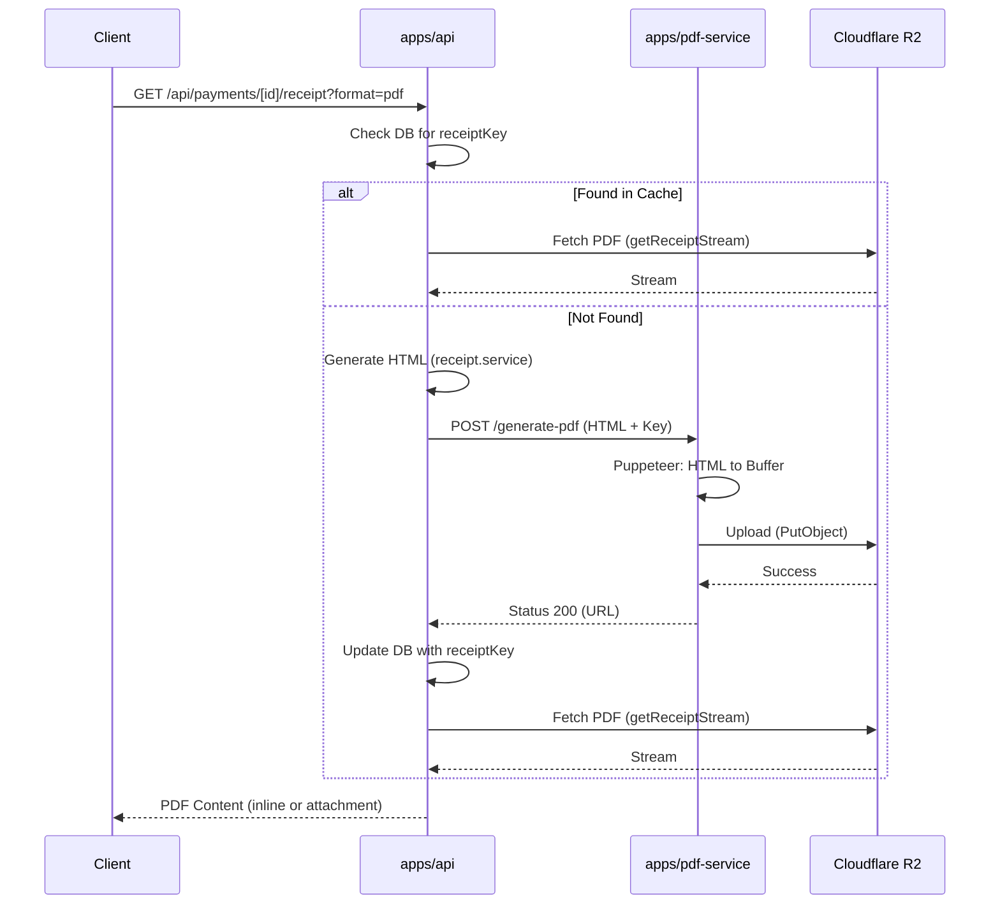

# PDF Service & R2 Storage Technical Documentation

This document outlines the architecture, data flow, and API contracts for the PDF generation service and its integration with Cloudflare R2 storage within the SkillYards ecosystem.

## Overview

The system uses a microservice architecture to isolate PDF generation (Puppeteer) from the main API. The main API generates HTML templates, which are then converted to PDFs by the `pdf-service` and persisted in R2 for caching and high availability.

---

## Architecture Diagram



---

## Component Breakdown

### 1. PDF Service (`apps/pdf-service`)

Standalone Node.js/Express service responsible for headless browser rendering and storage logic.

- **Entry Point**: `src/server.js`
- **Core Logic**:
  - `src/pdf.js`: Uses **Puppeteer** to render HTML string to an A4 PDF buffer.
  - `src/upload.js`: Uses `@aws-sdk/client-s3` to upload buffers to R2.
  - `src/r2.js`: Configures the S3 Client for Cloudflare R2 compatibility.

### 2. Main API Integration (`apps/api`)

The "orchestrator" that manages business logic, templates, and database coordination.

- **Integration Client**: `src/integrations/pdf/pdf.client.js`
  - Handles communication with the PDF service.
  - Implements **Exponential Backoff** and **Retry Logic** for 429 (Rate Limit) errors.
  - Timeout protection (15 seconds).
- **Service Logic**: `src/modules/payments/receipt.service.js`
  - Generates high-fidelity HTML/CSS specifically optimized for PDF rendering.
  - Handles R2 stream retrieval for serving files to clients.
- **Route Handler**: `src/app/api/payments/[id]/receipt/route.js`
  - Manages the caching logic (Check DB -> Generate -> Update DB -> Serve).

---

## API Documentation

### PDF Service: `POST /generate-pdf`

Used internally by the Main API.

**Payload**:

```json
{
  "html": "<html>...</html>",
  "key": "receipts/payment-uuid-123.pdf"
}
```

**Responsibilities**:

1. Validates `html` input.
2. Validates `key` follows the `receipts/*.pdf` pattern (Security measure).
3. Renders PDF via Puppeteer.
4. If `key` is present: Uploads to R2 and returns URL.
5. If `key` is absent: Returns the raw PDF buffer directly (legacy/debug mode).

---

## Key Technical Decisions

### 1. Externalized PDF Rendering

PDF generation is CPU/Memory intensive. Moving it to a separate service prevents Puppeteer from starving the main API of resources or causing crashes in the main application.

### 2. Bypass Proxy for Admin App

The Admin frontend calls the Main API directly for PDF operations. This prevents binary data corruption issues that often occur when proxying large files through intermediate Next.js API routes.

### 3. Native Caching

The `payments` table stores the `receiptKey` once a PDF is successfully uploaded. Subsequent requests fetch directly from R2, drastically reducing the load on the PDF service and minimizing Puppeteer boot-up overhead.

### 4. Direct R2 Streaming

The API serves files by streaming from R2. This ensures the full PDF doesn't have to be loaded into API memory before being sent to the client, improving scalability.

---

## Environment Variables Required

### PDF Service

- `R2_BUCKET`: The R2 bucket name.
- `R2_ENDPOINT`: Cloudflare S3 API endpoint.
- `R2_ACCESS_KEY` / `R2_SECRET_KEY`: R2 HMAC credentials.
- `PORT`: Service port (default 3001).

### Main API

- `PDF_SERVICE_URL`: URL to the `pdf-service` instance.
- `R2_BUCKET`, `R2_ENDPOINT`, `R2_ACCESS_KEY`, `R2_SECRET_KEY`: (For direct fetching).
